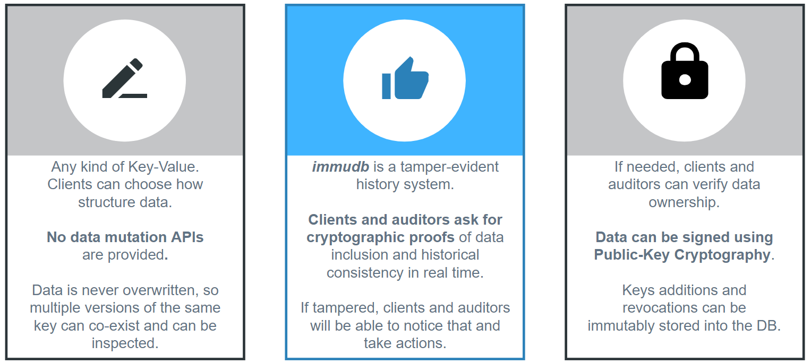
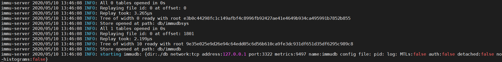
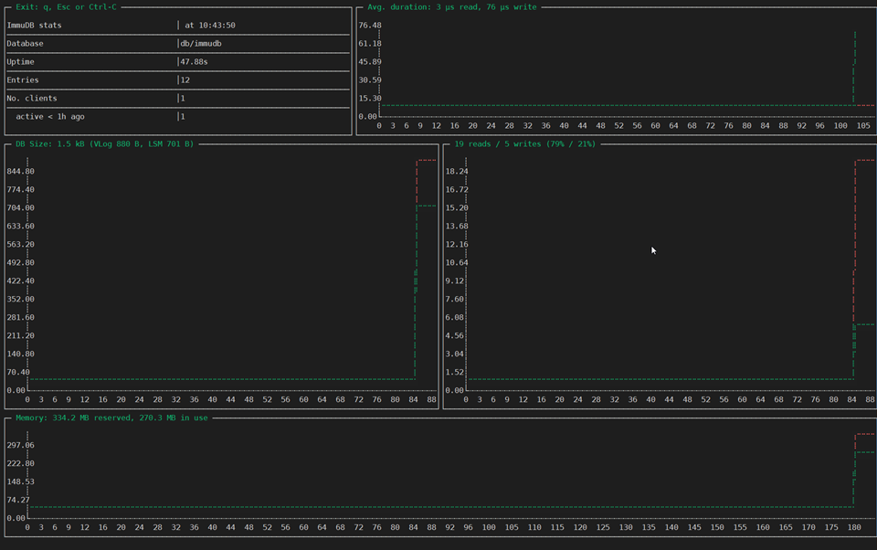
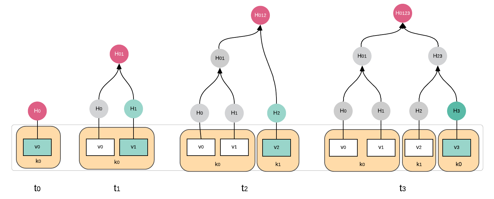
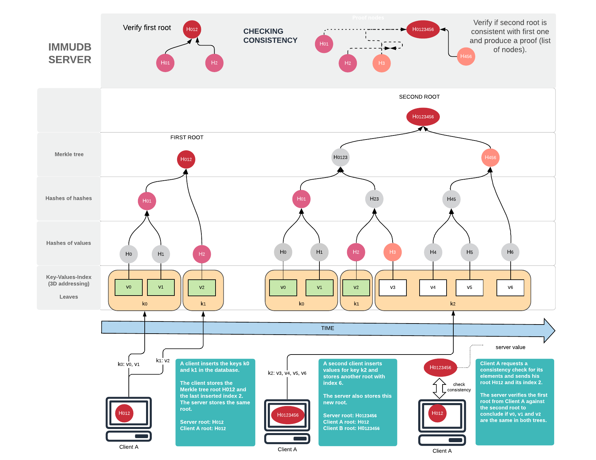
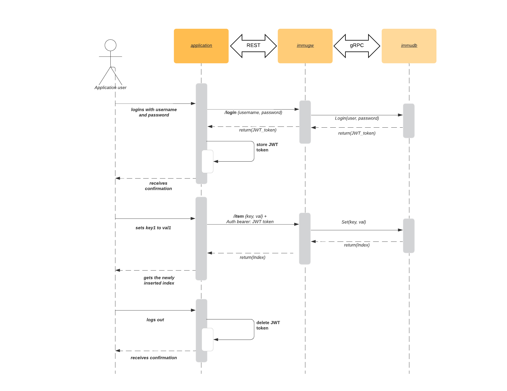
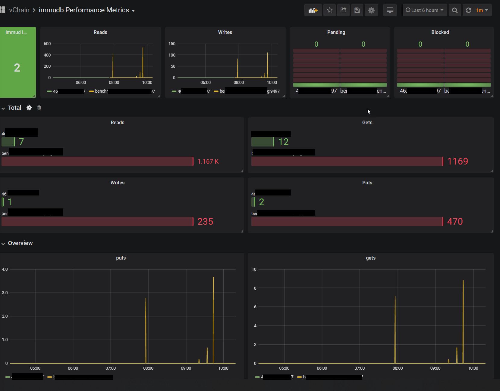

<!--
---

title: "immudb"

custom_edit_url: https://github.com/codenotary/immudb/edit/master/README.md
---

-->

# immudb [](https://travis-ci.com/codenotary/immudb) [](LICENSE) [](https://goreportcard.com/report/github.com/codenotary/immudb)  [](https://gitter.im/immudb-chat/community?utm_source=badge&utm_medium=badge&utm_campaign=pr-badge) [](https://formulae.brew.sh/formula/immudb) [](https://immudb.io/careers/)

immudb is a **lightweight, high-speed immutable database** for systems and applications. Written in Go.
With immudb you can track changes in sensitive data in your transactional databases and then record those changes permanently in a
tamperproof immudb database. This allows you to keep an indelible history of sensitive data, for example debit/credit card transactions.


Traditional DB transactions and logs are hard to scale and are mutable. So there is no way to know for sure if your data has been compromised.

As such, immudb provides **unparalleled insights** **retroactively** of changes to your sensitive data, even
if your perimeter has been compromised. immudb guarantees immutability by using a **Merkle tree structure** internally.

immudb gives you the same **cryptographic verification** of the integrity of data written with **SHA-256** like a classic blockchain without the cost and complexity associated with blockchains today.

immudb has 4 main benefits:

1. **immudb is immutable**. You can add records, but **never change or delete records**.
2. Data stored in immudb is **cryptographically coherent and verifiable**, like blockchains, just without all the complexity and at high speed.
3. Anyone can get **started with immudb in minutes**. Whether you're using node.js, Java, Python, Go, .Net, or any other language. It's very easy to use and you can have your immutable database running in just a few minutes.
4. Finally, immudb is  **Open Source**. You can run it **on premise**, or in the **cloud**. It's completely free. immudb is governed by the Apache 2.0 License.

immudb can be ran on **Linux**, **FreeBSD**, **Windows**, and **MacOS**, along with
other systems derived from them, such as **Kubernetes** and **Docker**.


**Designed for maximum performance**

* 4 CPU cores
* Intel(R) Xeon(R) CPU E3-1275 v6 @ 3.80GHz
* 64 GB memory
* SSD

**sequential** *write*
```
Concurrency: 128
Iterations: 1000000
Elapsed t.: 3.06 sec
Throughput: 326626 tx/sec
```

**batch** *write (async commit)*
```
Concurrency: 16
Iterations: 1000000
Elapsed t.: 0.36 sec
Throughput: 2772181 tx/sec
```

As immudb is sometimes compared to Amazon QLDB, we compared the performance using a simple demo application to write data (without using any unfair optimization).

")

")

")

")


**immudb High-level**



## [We are hiring!](https://immudb.io/careers/)

[](https://twitter.com/intent/tweet?text=immudb:%20lightweight,%20high-speed%20immutable%20database!&url=https://github.com/codenotary/immudb)


## Contents

1.  [What does it look like?](#what-does-it-look-like) - Take a quick tour through the project
2.  [Our userbase](#user-base) - Our userbase
3.  [Quickstart](#quickstart) - How to try it now on your systems, get a Docker container running in seconds
4.  [Why immudb](#why-immudb) - Why people love immudb and how it compares with other solutions
5.  [News](#news) - The latest news about immudb
6.  [How immudb works](#how-immudb-works) - A high-level diagram of how immudb works
7.  [Features](#features) - How you'll use immudb on your systems
8.  [Monitor status and performance](#monitor-status-and-performance) - How you can monitor immudb
9.  [Real world examples](#real-world-examples) - Read about how others use immudb
10.  [Documentation](#documentation) - Read the documentation
11.  [FAQ](#faq) - Frequently asked questions
12.  [Community](#community) - Discuss immudb with others and get support
13.  [License](#license) - Check immudb's licencing
14.  [Is it awesome?](#is-it-awesome) - Yes.


## What does it look like?

**First Start**



**immuadmin performance view**




### Tech specs

| Topic                   | Description                                                   |
| ----------------------- | ------------------------------------------------------------- |
| DB Model                | Key-Value store with 3D access (key-value-index)              |
| Data scheme             | schema-free                                                   |
| Implementation design   | LSM tree with value log and parallel Merkle Tree              |
| Implementation language | Go                                                            |
| Server OS(s)            | BSD, Linux, OS X, Solaris, Windows                            |
| Embeddable              | Yes, optionally                                               |
| Server APIs             | gRPC (using protocol buffers); immudb RESTful; immugw RESTful |
| Partition methods       | Sharding                                                      |
| Consistency concepts    | Eventual Consistency Immediate Consistency                    |
| Transaction concepts    | ACID with Snapshot Isolation (SSI)                            |
| Durability              | Yes                                                           |
| Snapshots               | Yes                                                           |
| High Read throughput    | Yes                                                           |
| High Write throughput   | Yes                                                           |
| Optimized for SSD       | Yes                                                           |

## Our Userbase

### Docker pulls

We provide Docker images for the most common architectures. These are statistics reported by Docker Hub:

The immudb container images can be found here:

| Component  | Container image                                | Pull stats                                                                                                                                                                                           |
| ---------- | ---------------------------------------------- | ---------------------------------------------------------------------------------------------------------------------------------------------------------------------------------------------------- |
| immudb     | https://hub.docker.com/r/codenotary/immudb     | [](https://hub.docker.com/r/codenotary/immudb/)                 |
| immugw     | https://hub.docker.com/r/codenotary/immugw     | [](https://hub.docker.com/r/codenotary/immugw/)                 |
| immuadmin  | https://hub.docker.com/r/codenotary/immuadmin  | [](https://hub.docker.com/r/codenotary/immuadmin/)     |
| immuclient | https://hub.docker.com/r/codenotary/immuclient | [](https://hub.docker.com/r/codenotary/immuclient/) |


## Quickstart

### Components

- **immudb** is the server binary that listens on port 3322 on localhost and provides a gRPC interface
- **immugw** is the intelligent REST proxy that connects to immudb and provides a RESTful interface for applications. We recommend to run immudb and immugw on separate machines to enhance security
- **immuadmin** is the admin CLI for immudb and immugw. You can install and manage the service installation for both components and get statistics as well as runtime information.
- **immuclient** is the CLI client for immudb. You can read, write data into immudb from the commandline using direct or interactive mode.

The latest release binaries can be found [here](https://github.com/codenotary/immudb/releases )

#### Build the binaries yourself

To build the binaries yourself, simply clone this repo and run

```
make all
```


##### Linux (by component)

```bash
GOOS=linux GOARCH=amd64 make immuclient-static immuadmin-static immudb-static immugw-static
```

##### MacOS (by component)

```bash
GOOS=darwin GOARCH=amd64 make immuclient-static immuadmin-static immudb-static immugw-static
```

##### Windows (by component)

```bash
GOOS=windows GOARCH=amd64 make immuclient-static immuadmin-static immudb-static immugw-static
```

##### Freebsd (by component)

```bash
GOOS=freebsd GOARCH=amd64 make immuclient-static immuadmin-static immudb-static immugw-static
```
#### immudb first start

##### Run immudb binary

```bash
# run immudb in the foreground
./immudb

# run immudb in the background
./immudb -d
```

##### Run immudb as a service (using immuadmin)

Please make sure to build or download the immudb and immuadmin component and save them in the same work directory when installing the service.

```
# install immudb service
./immuadmin service immudb install

# check current immudb service status
./immuadmin service immudb status

# stop immudb service
./immuadmin service immudb stop

# start immudb service
./immuadmin service immudb start
```

The linux service is using the following defaults:

| File or configuration   | location                   |
| ----------------------- | -------------------------- |
| all configuration files | /etc/immudb                |
| all data files          | /var/lib/immudb            |
| pid file                | /var/lib/immudb/immudb.pid |
| log files               | /var/log/immudb            |

The FreeBSD service is using the following defaults:

| File or configuration   | location            |
| ----------------------- | ------------------- |
| all configuration files | /etc/immudb         |
| all data files          | /var/lib/immudb     |
| pid file                | /var/run/immudb.pid |
| log files               | /var/log/immudb     |

##### Run immugw as a service (using immuadmin)

Please make sure to build or download the immugw and immuadmin component and save them in the same work directory when installing the service.

```
# install immugw service
./immuadmin service immugw install

# check current immugw service status
./immuadmin service immugw status

# stop immugw service
./immuadmin service immugw stop

# start immugw service
./immuadmin service immugw start
```

The linux service is using the following defaults:

| File or configuration   | location                   |
| ----------------------- | -------------------------- |
| all configuration files | /etc/immudb                |
| pid file                | /var/lib/immudb/immugw.pid |
| log files               | /var/log/immudb            |

The FreeBSD service is using the following defaults:

| File or configuration   | location            |
| ----------------------- | ------------------- |
| all configuration files | /etc/immudb         |
| pid file                | /var/run/immugw.pid |
| log files               | /var/log/immudb     |

#### Command reference

##### immudb

Simply run `./immudb -d` to start immudb locally in the background.

If you want to stop immudb în that case you need to find the process `ps -ax | grep immudb` and then `kill -15 <pid>`. Windows PowerShell would be `Get-Process immudb* | Stop-Process`.

```bash
immudb - the lightweight, high-speed immutable database for systems and applications.

Environment variables:
  IMMUDB_DIR=.
  IMMUDB_NETWORK=tcp
  IMMUDB_ADDRESS=127.0.0.1
  IMMUDB_PORT=3322
  IMMUDB_DBNAME=immudb
  IMMUDB_PIDFILE=
  IMMUDB_LOGFILE=
  IMMUDB_MTLS=false
  IMMUDB_AUTH=true
  IMMUDB_DETACHED=false
  IMMUDB_CONSISTENCY_CHECK=true
  IMMUDB_PKEY=./tools/mtls/3_application/private/localhost.key.pem
  IMMUDB_CERTIFICATE=./tools/mtls/3_application/certs/localhost.cert.pem
  IMMUDB_CLIENTCAS=./tools/mtls/2_intermediate/certs/ca-chain.cert.pem
  IMMUDB_DEVMODE=true
  IMMUDB_ADMIN_PASSWORD=immudb
  IMMUDB_MAINTENANCE=false

Usage:
  immudb [flags]
  immudb [command]

Available Commands:
  help        Help about any command
  version     Show the immudb version

Flags:
  -a, --address string          bind address (default "127.0.0.1")
      --admin-password string   admin password (default is 'immu') as plain-text or base64 encoded (must be prefixed with 'enc:' if it is encoded)
  -s, --auth                    enable auth
      --certificate string      server certificate file path (default "./tools/mtls/3_application/certs/localhost.cert.pem")
      --clientcas string        clients certificates list. Aka certificate authority (default "./tools/mtls/2_intermediate/certs/ca-chain.cert.pem")
      --config string           config file (default path are configs or $HOME. Default filename is immudb.ini)
      --consistency-check       enable consistency check monitor routine. To disable: --consistency-check=false (default true)
  -n, --dbname string           db name (default "immudb")
  -d, --detached                run immudb in background
      --devmode                 enable dev mode: accept remote connections without auth
      --dir string              data folder (default "./data")
  -h, --help                    help for immudb
      --logfile string          log path with filename. E.g. /tmp/immudb/immudb.log
  -m, --mtls                    enable mutual tls
      --no-histograms           disable collection of histogram metrics like query durations
      --pidfile string          pid path with filename. E.g. /var/run/immudb.pid
      --pkey string             server private key path (default "./tools/mtls/3_application/private/localhost.key.pem")
  -p, --port int                port number (default 3322)

Use "immudb [command] --help" for more information about a command.

```

##### immugw

Simply run `./immugw -d` to start immugw on the same machine as immudb (test or dev environment) or pointing to the remote immudb system ```./immugw --immudb-address "immudb-server"```.

If you want to stop immugw în that case you need to find the process `ps -ax | grep immugw` and then `kill -15 <pid>`. Windows PowerShell would be `Get-Process immugw* | Stop-Process`.

```bash
immu gateway: a smart REST proxy for immudb - the lightweight, high-speed immutable database for systems and applications.
It exposes all gRPC methods with a REST interface while wrapping all SAFE endpoints with a verification service.

Environment variables:
  IMMUGW_ADDRESS=127.0.0.1
  IMMUGW_PORT=3323
  IMMUGW_IMMUDB_ADDRESS=127.0.0.1
  IMMUGW_IMMUDB_PORT=3322
  IMMUGW_DIR=.
  IMMUGW_PIDFILE=
  IMMUGW_LOGFILE=
  IMMUGW_DETACHED=false
  IMMUGW_MTLS=false
  IMMUGW_SERVERNAME=localhost
  IMMUGW_PKEY=./tools/mtls/4_client/private/localhost.key.pem
  IMMUGW_CERTIFICATE=./tools/mtls/4_client/certs/localhost.cert.pem
  IMMUGW_CLIENTCAS=./tools/mtls/2_intermediate/certs/ca-chain.cert.pem
  IMMUGW_AUDIT="false"
  IMMUGW_AUDIT_PASSWORD=""
  IMMUGW_AUDIT_USERNAME=""

Usage:
  immugw [flags]
  immugw [command]

Available Commands:
  help        Help about any command
  version     Show the immugw version

Flags:
  -a, --address string            immugw host address (default "127.0.0.1")
      --audit                     enable audit mode (continuously fetches latest root from server, checks consistency against a local root and saves the latest root locally)
      --audit-interval duration   interval at which audit should run (default 5m0s)
      --audit-password string     immudb password used to login during audit; can be plain-text or base64 encoded (must be prefixed with 'enc:' if it is encoded)
      --audit-username string     immudb username used to login during audit (default "immugwauditor")
      --certificate string        server certificate file path (default "./tools/mtls/4_client/certs/localhost.cert.pem")
      --clientcas string          clients certificates list. Aka certificate authority (default "./tools/mtls/2_intermediate/certs/ca-chain.cert.pem")
      --config string             config file (default path are configs or $HOME. Default filename is immugw.toml)
  -d, --detached                  run immudb in background
      --dir string                program files folder (default ".")
  -h, --help                      help for immugw
  -k, --immudb-address string     immudb host address (default "127.0.0.1")
  -j, --immudb-port int           immudb port number (default 3322)
      --logfile string            log path with filename. E.g. /tmp/immugw/immugw.log
  -m, --mtls                      enable mutual tls
      --pidfile string            pid path with filename. E.g. /var/run/immugw.pid
      --pkey string               server private key path (default "./tools/mtls/4_client/private/localhost.key.pem")
  -p, --port int                  immugw port number (default 3323)
      --servername string         used to verify the hostname on the returned certificates (default "localhost")

Use "immugw [command] --help" for more information about a command.

```


##### immuadmin

For security reasons we recommend using immuadmin only on the same system as immudb. User management is restricted to localhost usage. Simply run ```./immuadmin``` on the same machine.

```bash
CLI admin client for immudb - the lightweight, high-speed immutable database for systems and applications.

Environment variables:
  IMMUADMIN_IMMUDB_ADDRESS=127.0.0.1
  IMMUADMIN_IMMUDB_PORT=3322
  IMMUADMIN_MTLS=true
  IMMUADMIN_SERVERNAME=localhost
  IMMUADMIN_PKEY=./tools/mtls/4_client/private/localhost.key.pem
  IMMUADMIN_CERTIFICATE=./tools/mtls/4_client/certs/localhost.cert.pem
  IMMUADMIN_CLIENTCAS=./tools/mtls/2_intermediate/certs/ca-chain.cert.pem

Usage:
  immuadmin [command]

Available Commands:
  backup      Make a copy of the database files and folders
  dump        Dump database content to a file
  help        Help about any command
  login       Login using the specified username and password (admin username is immu)
  logout
  restore     Restore the database from a snapshot archive or folder
  service     Manage immu services
  set         Update server config items: auth (none|password|cryptosig), mtls (true|false)
  stats       Show statistics as text or visually with the '-v' option. Run 'immuadmin stats -h' for details.
  status      Show heartbeat status
  user        Perform various user-related operations: list, create, deactivate, change password, set permissions
  version     Show the immuadmin version

Flags:
      --certificate string      server certificate file path (default "./tools/mtls/4_client/certs/localhost.cert.pem")
      --clientcas string        clients certificates list. Aka certificate authority (default "./tools/mtls/2_intermediate/certs/ca-chain.cert.pem")
      --config string           config file (default path is configs or $HOME; default filename is immuadmin.toml)
  -h, --help                    help for immuadmin
  -a, --immudb-address string   immudb host address (default "127.0.0.1")
  -p, --immudb-port int         immudb port number (default 3322)
  -m, --mtls                    enable mutual tls
      --pkey string             server private key path (default "./tools/mtls/4_client/private/localhost.key.pem")
      --servername string       used to verify the hostname on the returned certificates (default "localhost")
      --tokenfile string        authentication token file (default path is $HOME or binary location; the supplied value will be automatically suffixed with _admin; default filename is token_admin) (default "token")

Use "immuadmin [command] --help" for more information about a command.

```

##### immuclient

Simply run ```./immuclient``` on the same machine or ```./immuclient -a <immudb-host>```

```bash
CLI client for immudb - the lightweight, high-speed immutable database for systems and applications.
Environment variables:
  IMMUCLIENT_IMMUDB_ADDRESS=127.0.0.1
  IMMUCLIENT_IMMUDB_PORT=3322
  IMMUCLIENT_AUTH=true
  IMMUCLIENT_MTLS=false
  IMMUCLIENT_SERVERNAME=localhost
  IMMUCLIENT_PKEY=./tools/mtls/4_client/private/localhost.key.pem
  IMMUCLIENT_CERTIFICATE=./tools/mtls/4_client/certs/localhost.cert.pem
  IMMUCLIENT_CLIENTCAS=./tools/mtls/2_intermediate/certs/ca-chain.cert.pem

IMPORTANT: All get and safeget functions return base64-encoded keys and values, while all set and safeset functions expect base64-encoded inputs.

Usage:
  immuclient [flags]
  immuclient [command]

Available Commands:
  audit-mode        Starts immuclient as daemon in auditor mode. Run 'immuclient audit-mode help' or use -h flag for details
  check-consistency Check consistency for the specified index and hash
  count             Count keys having the specified prefix
  current           Return the last merkle tree root and index stored locally
  database          Issue all database commands
  get               Get item having the specified key
  getByIndex        Return an element by index
  getRawBySafeIndex Return an element by index
  help              Help about any command
  history           Fetch history for the item having the specified key
  inclusion         Check if specified index is included in the current tree
  iscan             Iterate over all elements by insertion order
  it                Starts immuclient in CLI mode. Use 'help' or -h flag on the shell for details
  login             Login using the specified username and password
  logout
  rawsafeget        Get item having the specified key, without parsing structured values
  rawsafeset        Set a value for the item having the specified key, without setup structured values
  reference         Add new reference to an existing key
  safeget           Get and verify item having the specified key
  safereference     Add and verify new reference to an existing key
  safeset           Add and verify new item having the specified key and value
  safezadd          Add and verify new key with score to a new or existing sorted set
  scan              Iterate over keys having the specified prefix
  set               Add new item having the specified key and value
  status            Ping to check if server connection is alive
  use               select database
  user              Issue all user commands
  version           Show the immuclient version
  zadd              Add new key with score to a new or existing sorted set
  zscan             Iterate over a sorted set

Flags:
      --audit-password string    immudb password used to login during audit; can be plain-text or base64 encoded (must be prefixed with 'enc:' if it is encoded)
      --audit-username string    immudb username used to login during audit
      --certificate string       server certificate file path (default "./tools/mtls/4_client/certs/localhost.cert.pem")
      --clientcas string         clients certificates list. Aka certificate authority (default "./tools/mtls/2_intermediate/certs/ca-chain.cert.pem")
      --config string            config file (default path are configs or $HOME. Default filename is immuclient.toml)
      --dir string               Main directory for audit process tool to initialize (default "/var/folders/7c/2189p7097pzgjmhz046qms940000gn/T/")
  -h, --help                     help for immuclient
  -a, --immudb-address string    immudb host address (default "127.0.0.1")
  -p, --immudb-port int          immudb port number (default 3322)
  -m, --mtls                     enable mutual tls
      --pkey string              server private key path (default "./tools/mtls/4_client/private/localhost.key.pem")
      --prometheus-host string   Launch host of the Prometheus exporter. (default "127.0.0.1")
      --prometheus-port string   Launch port of the Prometheus exporter. (default "9477")
      --roots-filepath string    Filepath for storing root hashes after every successful audit loop. Default is tempdir of every OS. (default "/tmp/")
      --servername string        used to verify the hostname on the returned certificates (default "localhost")
      --tokenfile string         authentication token file (default path is $HOME or binary location; default filename is token) (default "token")
      --value-only               returning only values for get operations

Use "immuclient [command] --help" for more information about a command.
```


### Docker

All services and cli components are also available as docker images on dockerhub.com.

| Component  | Container image                                |
| ---------- | ---------------------------------------------- |
| immudb     | https://hub.docker.com/r/codenotary/immudb     |
| immugw     | https://hub.docker.com/r/codenotary/immugw     |
| immuadmin  | https://hub.docker.com/r/codenotary/immuadmin  |
| immuclient | https://hub.docker.com/r/codenotary/immuclient |

#### Run immudb

```bash
docker run -it -d -p 3322:3322 -p 9497:9497 --name immudb codenotary/immudb:latest
```

#### Run immugw

```
docker run -it -d -p 3323:3323 --name immugw --env IMMUGW_IMMUDB_ADDRESS=immudb codenotary/immugw:latest
```

#### Run immuadmin

You can either find immuadmin in the immudb container (/usr/local/bin/immuadmin) or run the docker container to connect to the local immudb.

```
docker run -it --rm --name immuadmin codenotary/immuadmin:latest status
```

#### Run immuclient

You can either find immuclient in the immudb container (/usr/local/bin/immuclient) or run the docker container to connect to the local or remote immudb.

```
docker run -it --rm --name immuclient codenotary/immuclient:latest -a <immudb-host>
```

#### Build the container images yourself

If you want to build the container images yourself, simply clone this repo and run

```
docker build -t myown/immudb:latest -f Dockerfile .
docker build -t myown/immugw:latest -f Dockerfile.immugw .
docker build -t myown/immuadmin:latest -f Dockerfile.immuadmin .
docker build -t myown/immuclient:latest -f Dockerfile.immuclient .
```

## Why immudb

immudb has been developed with performance, scalability and versatility in mind. The user feedback has shown that they love the very high throughput and being able to store hashes as well as data. They see it as a great alternative to using a blockchain or ledger service.

That makes immudb fit to store changes to other database fields (like Microsoft SQL or MongoDB) in a tamperproof fashion.

You can find an example video here:

[](http://www.youtube.com/watch?v=rQ4iZAM14m0 "track changes in sensitive data in your transactional databases")


## News
`June 16th, 2020` - **[immudb v0.6.2 released!](https://github.com/codenotary/immudb/releases)**

Release v0.6.2 Release v0.6.2 ringbuffer management fix, improved user management for automatic deployment, improved container support

`June 9th, 2020` - **[immudb v0.6.1 released!](https://github.com/codenotary/immudb/releases)**

Release v0.6.1 fixes some important bugs and has many improvements - we recommend updating to it

`May 28, 2020` - **[immudb v0.6.0 GA released!](https://github.com/codenotary/immudb/releases)**

We're thrilled to announce our GA Release v0.6.0 that contains many improvements, bug fixes and new audit features.


`May 19, 2020` - **[immudb v0.6.0-rc2 released!](https://github.com/codenotary/immudb/releases)**

Release v0.6.0-rc2 is our second public release and contains an all new immuclient CLI as well as a built-in Trust Checker that does a server based continous consistency check.


`May 11, 2020` - **[immudb v0.6.0-rc1 released!](https://github.com/codenotary/immudb/releases)**

Release v0.6.0-rc1 is our first release to the public. While we were using immudb for quite some time in the [codenotary.io](https://www.codenotary.io) platform, we're thrilled to finally release it to the Open Source community (Apache 2 license).

The release contains 3 components, the main immutable database immudb, a RESTful proxy called immugw and the admin CLI tool immuadmin. immudb is ready to be used on Linux as well as Microsoft Windows.


## How immudb works

#### adding data

When adding data the merkle tree changes as well as shown in the diagram



#### checking data consistency

The following diagram explains how data is inserted, verified and consistency checked.




#### immugw communication

immugw proxies REST client communication and gRPC server interface. For security purposes immugw should not run on the same server as immudb. The following diagram shows how the communication works:



## Features

#### Simplified API for safe SET/GET

single API call that performs all steps and returns the proofs directly.

#### REST gateway (for legacy systems)

A gRPC REST gateway is a reverse proxy that sits in the middle between the gRPC API and the application.

Other than simply converting the gRPC API to a REST interface, this component will have a built-in verification on query results and will return the verification result directly.

This solution is completely transparent: the client application can use just one endpoint (the REST interface) to perform all operations.
The REST gateway can be also embedded into the immudb binary directly.

#### Drivers for Common Languages

Drivers will soon be available for:

1. Java
2. .net
3. Go
4. Python
5. Node.js

#### Structured value

Protobuf's [Any](https://developers.google.com/protocol-buffers/docs/proto3#any) message type allows callers to use
messages as embedded types without having their .proto definition. Thus, it will soon be possible to decouple and extend
the value structure. The value, currently a stream of bytes, can be augmented with some client provided metadata.
This also permits use of an on-demand serialization/deserialization strategy.

The payload includes a timestamp and a value at the moment. In the near future cryptographic signatures will be added as well.
It will be possible to decouple and extend this in the future. The entire payload contribute to hash generation and is inserted in
the merkle tree.

All the complexity is hidden by the SDK.

#### Item References

Enables the insertion of a special entry which references to another item

#### Value timestamp

The server should not set the timestamp, to avoid relying on a non-verifiable “single source of truth”.
Thus, the clients must provide it. The client driver implementation can automatically do that for the user.

#### Primary Index

Index enables queries and search based on the data key

#### Secondary Index

Index enables queries and search based on the data value

#### Cryptographic signatures

A signature (PKI) provided by the client can be became part of the insertion process

#### Authentication (transport)

Integrated mTLS offers the best approach for machine-to-machine authentication, also providing communications security (entryption) over the transport channel

## Monitor status and performance

### immuadmin CLI

With `immuadmin stats` you can access text `-t` or visual statistics:

```
./immuadmin stats -t
Database path              :    db/immudb
Uptime                     :    1m38.64s
Number of entries          :    12
LSM size                   :    701 B
VLog size                  :    1.1 kB
Total size                 :    1.8 kB
Number of clients          :    1
Queries per client         :
   127.0.0.1               :    26
      Last query           :    749.641765ms ago
Avg. duration (nb calls)   :    µs
   ByIndex (0)             :    0
   ByIndexSV (0)           :    0
   ChangePassword (0)      :    0
   Consistency (0)         :    0
   Count (0)               :    0
   CreateUser (0)          :    0
   CurrentRoot (0)         :    0
   DeactivateUser (0)      :    0
   Dump (0)                :    0
   Get (5)                 :    20
   GetBatch (0)            :    0
   GetBatchSV (0)          :    0
   GetSV (0)               :    0
   Health (16)             :    33
   History (0)             :    0
   HistorySV (0)           :    0
   IScan (0)               :    0
   IScanSV (0)             :    0
   Inclusion (0)           :    0
   Login (0)               :    0
   Reference (0)           :    0
   SafeGet (0)             :    0
   SafeGetSV (0)           :    0
   SafeReference (0)       :    0
   SafeSet (0)             :    0
   SafeSetSV (0)           :    0
   SafeZAdd (0)            :    0
   Scan (0)                :    0
   ScanSV (0)              :    0
   Set (5)                 :    76
   SetBatch (0)            :    0
   SetBatchSV (0)          :    0
   SetSV (0)               :    0
   ZAdd (0)                :    0
   ZScan (0)               :    0
   ZScanSV (0)             :    0

```

or visual (default)


### Performance monitoring (Prometheus)

immudb has a built-in prometheus exporter that publishes all metrics at port 9497 (:9497/metrics) by default. When running a Prometheus instance, you can configure the target like in this example:

```
  - job_name: 'immudbmetrics'
    scrape_interval: 60s
    static_configs:
         - targets: ['my-immudb-server:9497']

```

#### Grafana

There is a Grafana dashboard available as well: https://grafana.com/grafana/dashboards/12026




## Real world examples

We already learned about the following use cases from users:

- use immudb to immutably store every update to sensitive database fields (credit card or bank account data) of an existing application database
- store CI/CD recipes in immudb to protect build and deployment pipelines
- store public certificates in immudb
- use immudb as an additional hash storage for digital objects checksums
- store log streams (i. e. audit logs) tamperproof

### Companies using immudb

[Opvizor](https://www.opvizor.com) - immutable log (syslog) solution for VMware vSphere

[eSoftThings ](https://www.esoftthings.com/en/)

[Greentube](https://www.greentube.com/)

[TA Capital](http://www.ta.capital)

[tinaba](https://www.tinaba.bancaprofilo.it/)


## Documentation

### immudb RESTful API reference

You can find the swagger schema here:

https://github.com/codenotary/immudb/blob/master/pkg/api/schema/schema.swagger.json

If you want to run the Swagger UI, simply run the following docker command after you cloned this repo:

```
docker run -d -it -p 8080:8080 --name swagger-immudb -v ${PWD}/pkg/api/schema/schema.swagger.json:/openapi.json -e SWAGGER_JSON=/openapi.json  swaggerapi/swagger-ui
```

### immudb gRPC API reference

coming soon

### immugw RESTful API reference

You can find the swagger schema here:

https://github.com/codenotary/immudb/blob/master/pkg/api/schema/gw.schema.swagger.json

If you want to run the Swagger UI, simply run the following docker command after you cloned this repo:

```
docker run -d -it -p 8081:8080 --name swagger-immugw -v ${PWD}/pkg/api/schema/gw.schema.swagger.json:/openapi.json -e SWAGGER_JSON=/openapi.json  swaggerapi/swagger-ui
```


## FAQ

| Question                                                                                     | Answer                                                                                                                                                                                                                                                                                                                                                                                                    | Release date    |
| -------------------------------------------------------------------------------------------- | --------------------------------------------------------------------------------------------------------------------------------------------------------------------------------------------------------------------------------------------------------------------------------------------------------------------------------------------------------------------------------------------------------- | --------------- |
| Where is the Immudb data stored?                                                             | The data location can be defined using the directory parameter when starting immudb. By default the data is in `/var/lib/immudb`                                                                                                                                                                                                                                                                          | initial release |
| How is the data structured?                                                                  | Data is stored in a Key-Value fashion. Data is always appended and never overwritten, so multiple versions of the same Key-Value can exist and can be inspected (by using the History API).                                                                                                                                                                                                               | initial release |
| What kind of data can be stored?                                                             | Any kind of Key-Value of data, values can be json data, configuration data, etc... Clients can choose how to structure data.                                                                                                                                                                                                                                                                              | initial release |
| What happens to my data if someone tamperes with it?                                         | immudb is a tamper-evident history system. When data (or the data history) is being tampered, the DB will not able to produce a valid consistency proof, so each client connect to the db will be able to notice the tampering and notify the user.                                                                                                                                                       | initial release |
| How can data be backed up?                                                                   | Currently the database needs to be stopped and the data files copied manually to backup. immudb will provide an APIs to perform online backups and restores in Q3/2020.                                                                                                                                                                                                                                   | initial release |
| How can data be restored?                                                                    | Backups files can easily restored by stopping the immudb server and replacing the data with the backed up files. If the backup data has been tampered the immudb server will detect that. API based restore is planned for Q3/2020                                                                                                                                                                        | initial release |
| Is there a way to incremently backup data?                                                   | immudb provides stream APIs and data can be streamed in insertion order, that can be easily used to perform incremental backups and incremental restores.                                                                                                                                                                                                                                                 | Q3/2020         |
| Is there a way to incremently restore data?                                                  | (see above)                                                                                                                                                                                                                                                                                                                                                                                               | Q3/2020         |
| How can the data be replicated to other systems?                                             | Our goal is to provide a scalable and redundant solution for enterprises. The investigation for the best approach is ongoing and not finalized yet. Our goal is to have it ready shortly after the official enterprise version release                                                                                                                                                                    | Q3/2020         |
| Would replication stop, when unverifiable data is detected?                                  | Customers will able to configure the wanted behavior when a unverifiable state is detected across replicas. By default, all valid replicas will able to continue working and replicas with invalid states will be skipped by all clients.                                                                                                                                                                 | Q3/2020         |
| Somebody changes one value in the database - how can it be detected and reverted?            | With replication, it's possible to detect which replica nodes are valid and which are not. If at least a replica node was not tampered data can be easily restored.                                                                                                                                                                                                                                       | Q3/2020         |
| Somebody changes the merkle root entry - how can I recover?                                  | Each client locally stores the last valid Merkle Tree Root (just 32 bytes of data). When the root of a DB instance is tampered then client will be able to mathematically proof that the provided root is not consistent with the last valid one. If an authenticated backup or a not tampered replica node is available, not-tampered data can be used to recover the Merkle Tree Root to a valid state. | Q3/2020         |
| How is the database protected? outside probes?                                               | Each client helps in protecting the DB. Special clients (called "agents") can be installed on different systems and continuously monitor the DB.                                                                                                                                                                                                                                                          | Q3/2020         |
| How can I monitor database performance?                                                      | immudb provides realtime metrics that can be collected using Prometheus                                                                                                                                                                                                                                                                                                                                   | initial release |
| How can I monitor database health?                                                           | immudb provides realtime healthcheck endpoints via API and immu client                                                                                                                                                                                                                                                                                                                                    | initial release |
| How can I monitor database integrity?                                                        | immudb provides proof APIs and clients and agents can ask for proof in realtime.                                                                                                                                                                                                                                                                                                                          | initial release |
| How can I monitor database integrity for single objects or specific entries?                 | immu client has a functionality to authenticate a specific entry at a given point in time. So both last version and the whole history of an item can be verified.                                                                                                                                                                                                                                         | initial release |
| Can I build and distribute an immudb that skips the verification? If yes, how to avoid that? | [CodeNotary](https://www.codenotary.io) team notarizes sources and releases of all immudb components. Check if the release binaries are notarized by vChain.us using [authenticate.codenotary.io](https://authenticate.codenotary.io/org/vchain.us) to prove origin and detect any kind of tampering.                                                                                                     | initial release |
| How many databases can I run on a single immudb server?                                      | We currently support one database, but in future releases there will be support for many databases.                                                                                                                                                                                                                                                                                                       | Q3/2020         |

## Community

We welcome [contributions](CONTRIBUTING.md). Feel free to join the team!

To report bugs or get help, use [GitHub's issues](https://github.com/codenotary/immudb/issues).


## License

immudb is [Apache v2.0 License](LICENSE).

immudb re-distributes other open-source tools and libraries - [Acknowledgements](ACKNOWLEDGEMENTS.md).


## Is it awesome?

Yes.
