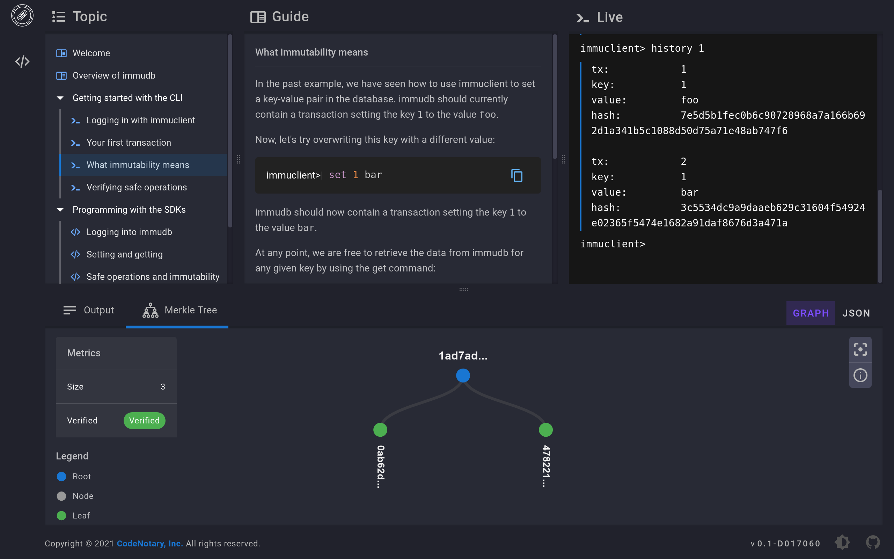
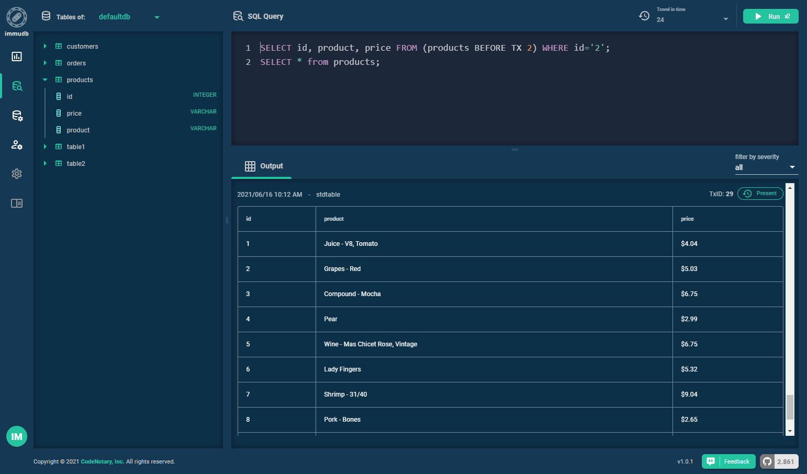

<!--
---

title: "immudb"

custom_edit_url: https://github.com/codenotary/immudb/edit/master/README.md
---

-->

# immudb 


[](https://docs.immudb.io/)
[](https://github.com/codenotary/immudb/actions/workflows/push.yml)
[](https://goreportcard.com/report/github.com/codenotary/immudb)
[](https://sbom.sh/37cbffcf-1bd3-4daf-86b7-77deb71575b7)
[](https://formulae.brew.sh/formula/immudb)

[](https://discord.gg/EWeCbkjZVu)
[](https://www.codenotary.com/job)
[](https://artifacthub.io/packages/search?repo=codenotary)

Don't forget to ⭐ this repo if you like immudb!

[:tada: 157M pulls from docker hub!](https://hub.docker.com/r/codenotary)

---

Detailed documentation can be found at https://docs.immudb.io/

---


immudb is a database with built-in cryptographic proof and verification. It tracks changes in sensitive data and the integrity of the history will be protected by the clients, without the need to trust the database. It can operate as a key-value store, as a document model database, and/or as relational database (SQL).

Traditional database transactions and logs are mutable, and therefore there is no way to know for sure if your data has been compromised. immudb is immutable. You can add new versions of existing records, but never change or delete records. This lets you store critical data without fear of it being tampered.

Data stored in immudb is cryptographically coherent and verifiable. Unlike blockchains, immudb can handle millions of transactions per second, and can be used both as a lightweight service or embedded in your application as a library. immudb runs everywhere, on an IoT device, your notebook, a server, on-premise or in the cloud.


When used as a relational data database, it supports both transactions and blobs, so there are no limits to the use cases. Developers and organizations use immudb to secure and tamper-evident log data, sensor data, sensitive data, transactions, software build recipes, rule-base data, artifacts and even video streams. [Examples of organizations using immudb today.](https://www.immudb.io)


## Contents

- [immudb](#immudb)
  - [Contents](#contents)
  - [Quickstart](#quickstart)
  - [Recent Changes](#recent-changes)
    - [Structured Audit Logging](#structured-audit-logging)
    - [DIFF OF SQL Query](#diff-of-sql-query)
    - [PostgreSQL SQL Compatibility](#postgresql-sql-compatibility)
    - [Security Hardening](#security-hardening)
  - [Using immudb](#using-immudb)
  - [Tech specs](#tech-specs)
  - [Performance figures](#performance-figures)
  - [Roadmap](#roadmap)
  - [Projects using immudb](#projects-using-immudb)
  - [Contributing](#contributing)

## Quickstart


### Getting immudb running: executable

You may download the immudb binary from [the latest releases on Github](https://github.com/codenotary/immudb/releases/latest). Once you have downloaded immudb, rename it to `immudb`, make sure to mark it as executable, then run it. The following example shows how to obtain v1.9.5 for linux amd64:

```bash
wget https://github.com/codenotary/immudb/releases/download/v1.9.5/immudb-v1.9.5-linux-amd64
mv immudb-v1.9.5-linux-amd64 immudb
chmod +x immudb

# run immudb in the foreground to see all output
./immudb

# or run immudb in the background
./immudb -d
```

### Getting immudb running: Docker

Use Docker to run immudb in a ready-to-use container:

```bash
docker run -d --net host -it --rm --name immudb codenotary/immudb:latest
```

If you are running the Docker image without host networking, make sure to expose ports 3322 and 9497.

### Getting immudb running: Kubernetes

In kubernetes, use helm for an easy deployment: just add our repository and install immudb with these simple commands:

```bash
helm repo add immudb https://packages.codenotary.org/helm
helm repo update
helm install immudb/immudb --generate-name
```

### Using subfolders

Immudb helm chart creates a persistent volume for storing immudb database.
Those database are now by default placed in a subdirectory.

That's for compatibility with ext4 volumes that have a `/lost+found` directory that can confuse immudb. Some volume providers,
like EBS or DigitalOcean, are using this kind of volumes. If we placed database directory on the root of the volume,
that `/lost+found` would be treated as a database. So we now create a subpath (usually `immudb`) subpath for storing that.

This is different from what we did on older (<=1.3.1) helm charts, so if you have already some volumes with data you can set
value volumeSubPath to false (i.e.: `--set volumeSubPath.enabled=false`) when upgrading so that the old way is used.

You can alternatively migrate the data in a `/immudb` directory. You can use this pod as a reference for the job:

```yaml
apiVersion: v1
kind: Pod
metadata:
  name: migrator
spec:
  volumes:
    - name: "vol0"
      persistentVolumeClaim:
        claimName: <your-claim-name-here>
  containers:
    - name: migrator
      image: busybox
      volumeMounts:
        - mountPath: "/data"
          name: "vol0"
      command:
        - sh
        - -c
        - |
          mkdir -p /data/immudb
          ls /data | grep -v -E 'immudb|lost\+found'|while read i; do mv /data/$i /data/immudb/$i; done
```

As said before, you can totally disable the use of subPath by setting `volumeSubPath.enabled=false`.
You can also tune the subfolder path using `volumeSubPath.path` value, if you prefer your data on a
different directory than the default `immudb`.

### Enabling Amazon S3 storage

immudb can store its data in the Amazon S3 service (or a compatible alternative).
The following example shows how to run immudb with the S3 storage enabled:

```bash
export IMMUDB_S3_STORAGE=true
export IMMUDB_S3_ACCESS_KEY_ID=<S3 ACCESS KEY ID>
export IMMUDB_S3_SECRET_KEY=<SECRET KEY>
export IMMUDB_S3_BUCKET_NAME=<BUCKET NAME>
export IMMUDB_S3_LOCATION=<AWS S3 REGION>
export IMMUDB_S3_PATH_PREFIX=testing-001
export IMMUDB_S3_ENDPOINT="https://${IMMUDB_S3_BUCKET_NAME}.s3.${IMMUDB_S3_LOCATION}.amazonaws.com"

./immudb
```

When working with the external storage, you can enable the option for the remote storage
to be the primary source of identifier. This way, if immudb is run using ephemeral disks,
such as with AWS ECS Fargate, the identifier can be taken from S3. To enable that, use:

```bash
export IMMUDB_S3_EXTERNAL_IDENTIFIER=true
```

You can also use the role-based credentials for more flexible and secure configuration.
This allows the service to be used with instance role configuration without a user entity.
The following example shows how to run immudb with the S3 storage enabled using AWS Roles:

```bash
export IMMUDB_S3_STORAGE=true
export IMMUDB_S3_ROLE_ENABLED=true
export IMMUDB_S3_BUCKET_NAME=<BUCKET NAME>
export IMMUDB_S3_LOCATION=<AWS S3 REGION>
export IMMUDB_S3_PATH_PREFIX=testing-001
export IMMUDB_S3_ENDPOINT="https://${IMMUDB_S3_BUCKET_NAME}.s3.${IMMUDB_S3_LOCATION}.amazonaws.com"

./immudb
```

If using Fargate, the credentials URL can be sourced automatically:

```bash
export IMMUDB_S3_USE_FARGATE_CREDENTIALS=true
```

Optionally, you can specify the exact role immudb should be using with:

```bash
export IMMUDB_S3_ROLE=<AWS S3 ACCESS ROLE NAME>
```

Remember, the `IMMUDB_S3_ROLE_ENABLED` parameter still should be on.

You can also easily use immudb with compatible s3 alternatives
such as the [minio](https://github.com/minio/minio) server:

```bash
export IMMUDB_S3_ACCESS_KEY_ID=minioadmin
export IMMUDB_S3_SECRET_KEY=minioadmin
export IMMUDB_S3_STORAGE=true
export IMMUDB_S3_BUCKET_NAME=immudb-bucket
export IMMUDB_S3_PATH_PREFIX=testing-001
export IMMUDB_S3_ENDPOINT="http://localhost:9000"

# Note: This spawns a temporary minio server without data persistence
docker run -d -p 9000:9000 minio/minio server /data

# Create the bucket - this can also be done through web console at http://localhost:9000
docker run --net=host -it --entrypoint /bin/sh minio/mc -c "
  mc alias set local http://localhost:9000 minioadmin minioadmin &&
  mc mb local/${IMMUDB_S3_BUCKET_NAME}
"

# Run immudb instance
./immudb
```

### Connecting with immuclient

You may download the immuclient binary from [the latest releases on Github](https://github.com/codenotary/immudb/releases/latest). Once you have downloaded immuclient, rename it to `immuclient`, make sure to mark it as executable, then run it. The following example shows how to obtain v1.5.0 for linux amd64:

```bash
wget https://github.com/codenotary/immudb/releases/download/v1.5.0/immuclient-v1.5.0-linux-amd64
mv immuclient-v1.5.0-linux-amd64 immuclient
chmod +x immuclient

# start the interactive shell
./immuclient

# or use commands directly
./immuclient help
```

Or just use Docker to run immuclient in a ready-to-use container. Nice and simple.

```bash
docker run -it --rm --net host --name immuclient codenotary/immuclient:latest
```


## Recent Changes

<details>
<summary><b>Structured Audit Logging</b></summary>


immudb now supports immutable, structured audit logging of all server operations. When enabled, every gRPC operation is recorded as a JSON audit event stored in immudb's own tamper-proof KV store under the `audit:` key prefix.

**Enable audit logging:**

```bash
# Log all operations
./immudb --audit-log

# Log only write, admin, auth, and system operations (exclude reads)
./immudb --audit-log --audit-log-events=write

# Log only admin, auth, and system operations
./immudb --audit-log --audit-log-events=admin
```

Each audit event captures:

| Field     | Description                                      |
| --------- | ------------------------------------------------ |
| `ts`      | Nanosecond timestamp                             |
| `user`    | Authenticated username                           |
| `ip`      | Client IP address                                |
| `db`      | Target database                                  |
| `method`  | gRPC method name                                 |
| `type`    | Event category: AUTH, ADMIN, WRITE, READ, SYSTEM |
| `ok`      | Whether the operation succeeded                  |
| `err`     | Error message (if failed)                        |
| `dur_ms`  | Operation duration in milliseconds               |
| `sid`     | Session ID                                       |

Audit events are written asynchronously to avoid impacting request latency. They can be queried using the standard `Scan` API with prefix `audit:` and verified with `VerifiableGet` for tamper-proof compliance evidence. Events are stored as JSON, ready for export to external SIEM systems (Splunk, ELK, etc.).

</details>

<details>
<summary><b>DIFF OF SQL Query</b></summary>


immudb now supports comparing table state between two points in time using the new `DIFF OF` SQL syntax:

```sql
SELECT _diff_action, id, title, active FROM (DIFF OF mytable) SINCE TX 100 UNTIL TX 200
```

The `_diff_action` column indicates whether each row was an `INSERT`, `UPDATE`, or `DELETE` within the specified transaction range. Both `SINCE`/`AFTER` and `UNTIL`/`BEFORE` period specifiers are supported. Standard `WHERE` clauses can be applied to filter results.

</details>

<details>
<summary><b>PostgreSQL SQL Compatibility</b></summary>


immudb's PostgreSQL wire protocol server now supports a comprehensive set of SQL features for ORM and tool compatibility. Connect with any PostgreSQL client (`psql`, pgAdmin, JDBC, SQLAlchemy, Django, GORM, ActiveRecord) and use standard SQL.

**RETURNING clause** for INSERT, UPDATE, and DELETE:

```sql
INSERT INTO users (name) VALUES ('Alice') RETURNING id, name;
UPDATE users SET name = 'Bob' WHERE id = 1 RETURNING *;
DELETE FROM users WHERE id = 1 RETURNING *;
```

**Common Table Expressions (WITH / WITH RECURSIVE)**:

```sql
WITH RECURSIVE tree AS (
    SELECT id, name FROM nodes WHERE parent_id = 0
    UNION ALL
    SELECT n.id, n.name FROM nodes n INNER JOIN tree t ON n.parent_id = t.id
)
SELECT * FROM tree;
```

**Window functions**:

```sql
SELECT name, dept,
    ROW_NUMBER() OVER (PARTITION BY dept ORDER BY salary DESC) rank,
    SUM(salary) OVER (PARTITION BY dept) dept_total,
    LAG(salary) OVER (ORDER BY salary) prev_salary
FROM employees;
```

Supported window functions: `ROW_NUMBER`, `RANK`, `DENSE_RANK`, `LAG`, `LEAD`, `FIRST_VALUE`, `LAST_VALUE`, `NTILE`, and window aggregates (`COUNT`, `SUM`, `MIN`, `MAX`, `AVG`).

**Views and Sequences**:

```sql
CREATE VIEW active_users AS SELECT * FROM users WHERE active = true;
CREATE SEQUENCE order_seq;
SELECT NEXTVAL('order_seq');
```

**Full SQL feature set**:

| Category | Features |
|----------|----------|
| Joins | INNER, LEFT, RIGHT, CROSS, FULL OUTER, NATURAL, USING |
| Subqueries | EXISTS, IN, NOT EXISTS, NOT IN (correlated and non-correlated) |
| Set operations | UNION, UNION ALL, EXCEPT, INTERSECT |
| DML | INSERT...ON CONFLICT DO UPDATE, INSERT/UPDATE/DELETE...RETURNING |
| DDL | CREATE/DROP VIEW, CREATE/DROP SEQUENCE, ALTER COLUMN, FOREIGN KEY |
| Ordering | ORDER BY with NULLS FIRST/LAST, LIMIT ALL |
| Pattern matching | LIKE, ILIKE (case-insensitive) -- standard SQL wildcards (`%` and `_`) |
| Query analysis | EXPLAIN |
| Aggregates | COUNT, SUM, MIN, MAX, AVG, COUNT(DISTINCT col), STRING_AGG(col, separator) |
| Type aliases | BIGINT, INT, SMALLINT, SERIAL, DOUBLE, REAL, NUMERIC, DECIMAL, BYTEA, JSONB, TIMESTAMPTZ, and more |
| Transactions | BEGIN, COMMIT, ROLLBACK, SAVEPOINT, ROLLBACK TO SAVEPOINT, RELEASE SAVEPOINT |
| Data import | COPY FROM stdin (bulk import via psql / pg_dump) |
| LATERAL joins | Correlated subqueries in FROM clause |
| Partial indexes | CREATE INDEX ... WHERE condition |

**75+ built-in functions** including:

- Math: `ABS`, `CEIL`, `FLOOR`, `ROUND`, `POWER`, `SQRT`, `MOD`, `SIGN`
- String: `CONCAT`, `CONCAT_WS`, `REPLACE`, `REVERSE`, `LEFT`, `RIGHT`, `LPAD`, `RPAD`, `SPLIT_PART`, `INITCAP`, `REPEAT`, `POSITION`, `MD5`, `REGEXP_REPLACE`, `TRANSLATE`
- Date/Time: `NOW`, `DATE_TRUNC`, `TO_CHAR`, `DATE_PART`, `AGE`, `EXTRACT`
- Conditional: `COALESCE`, `NULLIF`, `GREATEST`, `LEAST`, `CASE`
- Aggregate: `STRING_AGG`, `COUNT(DISTINCT col)`
- PG compatibility: `current_database()`, `current_schema()`, `current_user`, `format_type()`, `pg_encoding_to_char()`

**Immutable verification via SQL** -- query immudb's cryptographic proof system directly:

```sql
SELECT immudb_state();                         -- current database state and tx hash
SELECT immudb_verify_row('mytable', 1);        -- cryptographically verify a row
SELECT immudb_verify_tx(42);                   -- verify a transaction with proof
SELECT immudb_history('mykey');                -- full history of a key
```

**ORM introspection support** with `pg_catalog` tables (`pg_class`, `pg_attribute`, `pg_index`, `pg_constraint`, `pg_type`, `pg_namespace`, `pg_roles`, `pg_settings`, `pg_description`) and `information_schema` views (`tables`, `columns`, `schemata`, `key_column_usage`).

**Known limitations** -- the following PostgreSQL features are not yet supported:

| Feature | Reason |
|---------|--------|
| Generated columns (`GENERATED ALWAYS AS`) | Requires computed column infrastructure |
| Stored procedures / PL/pgSQL | Requires a language interpreter |
| GIN/GiST indexes | Only B-tree indexes currently supported |
| ARRAY, ENUM, composite types | Limited to 9 base types with aliases |
| `SUM(a * b)` expressions inside aggregates | Arithmetic not supported inside aggregate functions |

</details>

<details>
<summary><b>ORM and Application Compatibility</b></summary>


This branch significantly hardens the PostgreSQL wire protocol and SQL engine against the corner cases that real-world ORMs and applications hit. Verified workloads now include **Gitea 1.25.5** (full signup → repo creation → git push → issue lifecycle), **Ruby on Rails 7 / ActiveRecord** (Maybe Finance dashboard), **Django**, **GORM**, **XORM**, **golang-migrate**, **SQLAlchemy**, **lib/pq** and **pgx** drivers.

**System catalog and introspection emulation** -- ORMs probe these on every connection; immudb returns realistic results for:

- `pg_catalog`: `pg_class`, `pg_attribute`, `pg_index`, `pg_indexes`, `pg_constraint`, `pg_type`, `pg_namespace`, `pg_roles`, `pg_settings`, `pg_description`, `pg_tables`
- `information_schema`: `tables`, `columns`, `schemata`, `key_column_usage`
- Function emulation: `current_database()`, `current_schema()`, `current_user`, `format_type()`, `pg_encoding_to_char()`, `pg_get_indexdef()`, `regclass`/`regtype` casts
- XORM column-introspection short-circuit so schema syncs don't issue thousands of slow catalog reads

**Reserved-keyword identifier round-trip** -- ORMs that quote `"index"`, `"key"`, `"value"`, `"user"`, `"order"`, `"check"`, etc. now Just Work. Quoted identifiers map to a `_<word>` column on disk, and the wire layer reverse-renames them on the way out so client struct mappers see the original name.

**Parameter-bind protocol fixes** -- correct text- and binary-format handling for every Postgres type immudb supports:

- `BYTEA` in canonical PG hex format (`\x<hex>`) for both bind and result paths
- `BOOLEAN` accepts `t`/`f`, `true`/`false`, `1`/`0`
- `TIMESTAMP` accepts the Rails-style `YYYY-MM-DD HH:MM:SS.ffffff` text form
- `FLOAT8`, `INT8`, `JSONB`, `TIMESTAMPTZ` OIDs in `RowDescription` for ORM type inference
- `NULL` binds across all types
- Implicit `VARCHAR → BOOLEAN` coercion for ORMs that never declare a parameter type
- Bind type inference recurses into subquery expressions (`IN (SELECT …)`, scalar subqueries, `EXISTS`, `CASE WHEN`, `EXTRACT`, `ORDER BY` with bind params), so `lib/pq`'s ParameterDescription matches what the client is about to send

**SQL grammar additions and fixes** for ORM-emitted shapes:

- Unqualified column references inside `JOIN`/`WHERE` resolve across all FROM-scope tables (XORM emits `JOIN issue_assignees ON assignee_id = user.id` without table qualifier)
- Scalar subqueries usable in `WHERE`, `SELECT` projection, and `ORDER BY`
- `COUNT(DISTINCT col)`, `COUNT(1)` (rewritten to `COUNT(*)`), `STRING_AGG(col, sep)`, `SUM(CASE WHEN col = ? THEN 1 ELSE 0 END)` (rewritten when the shape matches)
- Alias names that match aggregate keywords (`SELECT id AS sum FROM …`)
- `LIKE` / `ILIKE` with standard SQL wildcards (`%`, `_`)
- Hash aggregate path for `GROUP BY` without sorted input; projection pushdown that skips decoding columns the query doesn't reference; secondary index used for `WHERE`-only `SELECT`

**DML correctness** -- semantics now match Postgres for the patterns ORMs rely on most:

- `INSERT … ON CONFLICT DO UPDATE SET col = expr` reads the EXISTING row's values when reducing `expr` (so per-group counters like XORM's `max_index = max_index + 1` actually increment)
- `RETURNING` capture is reset on every prepared-statement re-execution (so reused INSERTs over Bind/Execute don't return stale rows from earlier executions)
- `INSERT INTO schema_migrations` is automatically idempotent (`ON CONFLICT DO NOTHING`) so Rails / golang-migrate can re-run schema syncs safely
- Multi-statement transactions, `SAVEPOINT` / `ROLLBACK TO SAVEPOINT`, and explicit `BEGIN` / `COMMIT` / `ROLLBACK` track transaction status correctly so `lib/pq` and `pgx` accept the next query

**Logging and operability** -- benign client disconnects (Rails connection-pool churn, Gitea eventsource long-poll cancels) demoted from `[E]` to debug; per-session SQL parse cache and in-memory catalog cache reduce per-query overhead under ORM workloads.

</details>

<details>
<summary><b>Security Hardening</b></summary>


- **Path traversal protection**: Archive restore now validates extraction paths, rejecting entries that attempt directory escape via `..` or absolute paths.
- **Session invalidation**: User deactivation, password changes, permission changes, and SQL privilege changes now immediately terminate all active sessions for the affected user.
- **Token file permissions**: Client authentication tokens are now written with `0600` permissions (owner-only) instead of `0644`.
- **PgSQL TLS warning**: The PostgreSQL-compatible server now logs a warning at startup when running without TLS, as cleartext password authentication is used.

</details>

## Using immudb

Lot of useful documentation and step by step guides can be found at https://docs.immudb.io/

### Real world examples

We already learned about the following use cases from users:

- use immudb to immutably store every update to sensitive database fields (credit card or bank account data) of an existing application database
- store CI/CD recipes in immudb to protect build and deployment pipelines
- store public certificates in immudb
- use immudb as an additional hash storage for digital objects checksums
- store log streams (i. e. audit logs) tamperproof
- store the last known positions of submarines
- record the location where fish was found aboard fishing trawlers

### How to integrate immudb in your application

We have SDKs available for the following programming languages:

1. Java [immudb4j](https://github.com/codenotary/immudb4j)
2. Golang ([golang sdk](https://pkg.go.dev/github.com/codenotary/immudb/pkg/client), [Gorm adapter](https://github.com/codenotary/immugorm))
3. .net [immudb4net](https://github.com/codenotary/immudb4net)
4. Python [immudb-py](https://github.com/codenotary/immudb-py)
5. Node.js [immudb-node](https://github.com/codenotary/immudb-node)

To get started with development, there is a [quickstart in our documentation](https://docs.immudb.io/master/immudb.html): or pick a basic running sample from [immudb-client-examples](https://github.com/codenotary/immudb-client-examples).

Our [immudb Playground](https://play.codenotary.com) provides a guided environment to learn the Python SDK.

<div align="center">
  <a href="https://play.codenotary.com">
    
  </a>
</div>

We've developed a "language-agnostic SDK" which exposes a REST API for easy consumption by any application.
[immugw](https://github.com/codenotary/immugw) may be a convenient tool when SDKs are not available for the
programming language you're using, for experimentation, or just because you prefer your app only uses REST endpoints.

### Online demo environment

Click here to try out the immudb web console access in an [online demo environment](https://demo.immudb.io) (username: immudb; password: immudb)

<div align="center">
  <a href="https://demo.immudb.io">
    
  </a>
</div>

## Tech specs

| Topic                   | Description                                         |
| ----------------------- | --------------------------------------------------- |
| DB Model                | Key-Value with 3D access, Document Model, SQL       |
| Data scheme             | schema-free                                         |
| Implementation design   | Cryptographic commit log with parallel Merkle Tree, |
|                         | (sync/async) indexing with extended B-tree          |
| Implementation language | Go                                                  |
| Server OS(s)            | BSD, Linux, OS X, Solaris, Windows, IBM z/OS        |
| Embeddable              | Yes, optionally                                     |
| Server APIs             | gRPC, PostgreSQL wire protocol (v3)                 |
| Partition methods       | Sharding                                            |
| Consistency concepts    | Immediate Consistency                               |
| Transaction concepts    | ACID with Snapshot Isolation (SSI)                  |
| Durability              | Yes                                                 |
| Snapshots               | Yes                                                 |
| High Read throughput    | Yes                                                 |
| High Write throughput   | Yes                                                 |
| Optimized for SSD       | Yes                                                 |

## Performance figures

immudb can handle millions of writes per second. The following table shows performance of the embedded store inserting 1M entries on a machine with 4-core E3-1275v6 CPU and SSD disk:

| Entries | Workers | Batch | Batches | time (s) | Entries/s |
| ------- | ------- | ----- | ------- | -------- | --------- |
| 1M      | 20      | 1000  | 50      | 1.061    | 1.2M /s   |
| 1M      | 50      | 1000  | 20      | 0.543    | 1.8M /s   |
| 1M      | 100     | 1000  | 10      | 0.615    | 1.6M /s   |

You can generate your own benchmarks using the `stress_tool` under `embedded/tools`.

## Roadmap

The following topics are important to us and are planned or already being worked on:

* Data pruning
* Compression
* compatibility with other database storage files
* Easier API for developers
* API compatibility with other, well-known embedded databases

## Projects using immudb

Below is a list of known projects that use immudb:

- [alma-sbom](https://github.com/AlmaLinux/alma-sbom) - AlmaLinux OS SBOM data management utility.

- [immudb-log-audit](https://github.com/codenotary/immudb-log-audit) - A service and cli tool to store json formatted log input
  and audit it later in immudb Vault.

- [immudb-operator](https://github.com/unagex/immudb-operator) - Unagex Kubernetes Operator for immudb.

- [immufluent](https://github.com/codenotary/immufluent) - Send fluentbit collected logs to immudb.

- [immuvoting](https://github.com/padurean/immuvoting) - Publicly cryptographically verifiable electronic voting system powered by immudb.

Are you using immudb in your project? Open a pull request to add it to the list.

## Contributing

We welcome [contributors](CONTRIBUTING.md). Feel free to join the team!

<a href="https://github.com/codenotary/immudb/graphs/contributors">
  
</a>

Learn how to [build](BUILD.md) immudb components in both binary and Docker image form.

To report bugs or get help, use [GitHub's issues](https://github.com/codenotary/immudb/issues).

immudb is licensed under the [Business Source License 1.1](LICENSE).

immudb re-distributes other open-source tools and libraries - [Acknowledgements](ACKNOWLEDGEMENTS.md).
