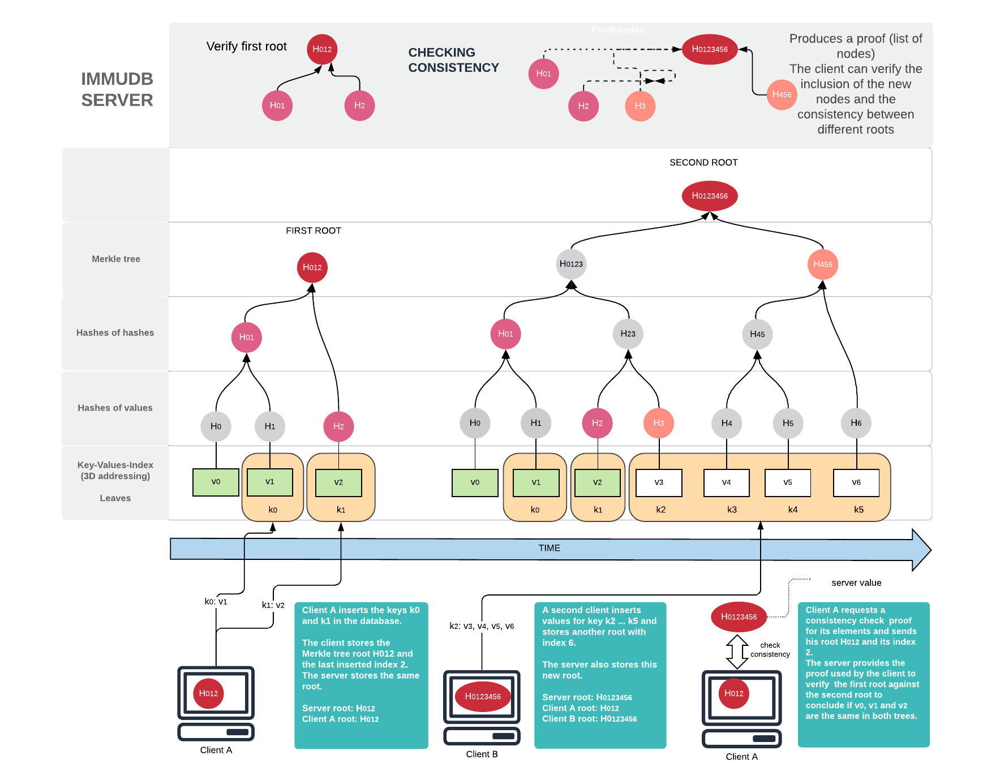

<!--
---

title: "immudb"

custom_edit_url: https://github.com/codenotary/immudb/edit/master/README.md
---

-->

# immudb [](LICENSE) 

[](https://travis-ci.com/codenotary/immudb)
[](https://goreportcard.com/report/github.com/codenotary/immudb)
[](https://coveralls.io/github/codenotary/immudb?branch=master)
[](https://formulae.brew.sh/formula/immudb)
[](https://github.com/avelino/awesome-go)

[](https://slack.vchain.us/)
[](https://groups.google.com/group/immudb)
[](https://immudb.io/careers/)

```
Dont forget to ⭐ this repo if you like immudb!
```

### **New**: immudb Coding Challenge - Winter 2020 Edition [#immuchallenge](https://github.com/codenotary/immuchallenge)

---

immudb is not a blockchain, immudb is the **lightweight, high-speed immutable database** with built-in cryptographic proof and verification.
With immudb you can track changes in sensitive data in your transactional databases and then record those changes permanently in a
tamperproof immudb database. This allows you to keep an indelible history of sensitive data, for example debit/credit card transactions.


Traditional DB transactions and logs are hard to scale and are mutable. So there is no way to know for sure if your data has been compromised.

As such, immudb provides **unparalleled insights** **retroactively** of changes to your sensitive data, even
if your perimeter has been compromised. immudb guarantees immutability by using a **Merkle tree structure** internally.

immudb gives you the same **cryptographic verification** of the integrity of data written with **SHA-256** like a classic blockchain without the cost and complexity associated with blockchains today.

immudb has 4 main benefits:

1. **immudb is immutable**. You can add records, but **never change or delete records**.
2. Data stored in immudb is **cryptographically coherent and verifiable**, like blockchains, just without all the complexity and at high speed.
3. Anyone can get **started with immudb in minutes**. Whether you're using node.js, Java, Python, Go, .Net, or any other language. It's very easy to use and you can have your immutable database running in just a few minutes.
4. Finally, immudb is  **Open Source**. You can run it **on premise**, or in the **cloud**. It's completely free. immudb is governed by the Apache 2.0 License.

immudb can be ran on **Linux**, **FreeBSD**, **Windows**, and **MacOS**, along with
other systems derived from them, such as **Kubernetes** and **Docker**.


**Designed for maximum performance**

* 4 CPU cores
* Intel(R) Xeon(R) CPU E3-1275 v6 @ 3.80GHz
* 64 GB memory
* SSD

**sequential** *write*
```
Concurrency: 128
Iterations: 1000000
Elapsed t.: 3.06 sec
Throughput: 326626 tx/sec
```

**batch** *write (async commit)*
```
Concurrency: 16
Iterations: 1000000
Elapsed t.: 0.36 sec
Throughput: 2772181 tx/sec
```


**immudb High-level**


## [We are hiring!](https://immudb.io/careers/)

[](https://twitter.com/intent/tweet?text=immudb:%20lightweight,%20high-speed%20immutable%20database!&url=https://github.com/codenotary/immudb)


## Contents

1.  [Quickstart](#quickstart) - Get immudb up and running in seconds
2.  [Using immudb](#using-immudb) - Official SDKs and REST-based client
3.  [CLI tools](#cli-tools) - Using `immuadmin` and `immuclient`
4.  [Migration from older releases](#migration-from-older-releases) - Easily migrate your existent database to latest release
5.  [News](#news) - The latest news about immudb
6.  [Tech specs](#tech-specs) - Technical details of the system in a nutshell
7.  [How immudb works](#how-immudb-works) - A high-level diagram of how immudb works
8.  [Real world examples](#real-world-examples) - Read about how others use immudb
9.  [Multiple databases](#multiple-databases) - Multiple databases
10.  [Documentation](#documentation) - Read the documentation
11.  [Community](#community) - Discuss immudb with others and get support
12.  [License](#license) - Check immudb's licencing

## Quickstart

Getting immudb up and running is quite simple. Choose any of following options:

1. [Running immudb in Docker](#running-immudb-in-docker)
2. [Download immudb release binary](#download-immudb-release-binary)
3. [Build immudb by yourself](#build-the-binaries-yourself)
4. [Running as a service](#run-immudb-as-a-service)


### Running immudb in Docker

1. Pull immudb Docker Image from Docker Hub:

```bash
docker pull codenotary/immudb:latest
```

2. Run immudb in a container:

```bash
docker run -it -d -p 3322:3322 -p 9497:9497 --name immudb codenotary/immudb:latest
```

immudb should be up and running, you can check the container logs:

```bash
docker logs immudb
```

### Download immudb release binary

Download latest release binaries from [here](https://github.com/codenotary/immudb/releases). Then just run immudb as follows:

```bash
# run immudb in the foreground
./immudb

# run immudb in the background
./immudb -d
```

To stop immudb in that case you need to find the process `ps -ax | grep immudb` and then `kill -15 <pid>`. Windows PowerShell would be `Get-Process immudb* | Stop-Process`.

Using non-default configuration:

```bash
immudb - the lightweight, high-speed immutable database for systems and applications.
Environment variables:
  IMMUDB_DIR=.
  IMMUDB_NETWORK=tcp
  IMMUDB_ADDRESS=0.0.0.0
  IMMUDB_PORT=3322
  IMMUDB_DBNAME=immudb
  IMMUDB_PIDFILE=
  IMMUDB_LOGFILE=
  IMMUDB_MTLS=false
  IMMUDB_AUTH=true
  IMMUDB_MAX_RECV_MSG_SIZE=4194304
  IMMUDB_DETACHED=false
  IMMUDB_CONSISTENCY_CHECK=true
  IMMUDB_PKEY=./tools/mtls/3_application/private/localhost.key.pem
  IMMUDB_CERTIFICATE=./tools/mtls/3_application/certs/localhost.cert.pem
  IMMUDB_CLIENTCAS=./tools/mtls/2_intermediate/certs/ca-chain.cert.pem
  IMMUDB_DEVMODE=true
  IMMUDB_MAINTENANCE=false
  IMMUDB_ADMIN_PASSWORD=immudb
  IMMUDB_SIGNING_KEY=
Usage:
  immudb [flags]
  immudb [command]

Available Commands:
  help        Help about any command
  version     Show the immudb version

Flags:
  -a, --address string          bind address (default "0.0.0.0")
      --admin-password string   admin password (default is 'immudb') as plain-text or base64 encoded (must be prefixed with 'enc:' if it is encoded) (default "immudb")
  -s, --auth                    enable auth
      --certificate string      server certificate file path (default "./tools/mtls/3_application/certs/localhost.cert.pem")
      --clientcas string        clients certificates list. Aka certificate authority (default "./tools/mtls/2_intermediate/certs/ca-chain.cert.pem")
      --config string           config file (default path are configs or $HOME. Default filename is immudb.toml)
      --consistency-check       enable consistency check monitor routine. To disable: --consistency-check=false (default true)
  -d, --detached                run immudb in background
      --devmode                 enable dev mode: accept remote connections without auth
      --dir string              data folder (default "./data")
      --max-recv-msg-size       max message size in bytes the server can receive
  -h, --help                    help for immudb
      --logfile string          log path with filename. E.g. /tmp/immudb/immudb.log
      --maintenance             override the authentication flag
  -m, --mtls                    enable mutual tls
      --no-histograms           disable collection of histogram metrics like query durations
      --pidfile string          pid path with filename. E.g. /var/run/immudb.pid
      --pkey string             server private key path (default "./tools/mtls/3_application/private/localhost.key.pem")
  -p, --port int                port number (default 3322)
      --signingKey string       signature private key path. If a valid one is provided, it enables the cryptographic signature of the root. E.g. "./../test/signer/ec3.key"


Use "immudb [command] --help" for more information about a command.
```

### Build the binaries yourself

To build the binaries yourself, simply clone this repo and run

```
make all
```

##### Linux (by component)

```bash
GOOS=linux GOARCH=amd64 make immuclient-static immuadmin-static immudb-static
```

##### MacOS (by component)

```bash
GOOS=darwin GOARCH=amd64 make immuclient-static immuadmin-static immudb-static
```

##### Windows (by component)

```bash
GOOS=windows GOARCH=amd64 make immuclient-static immuadmin-static immudb-static
```

##### Freebsd (by component)

```bash
GOOS=freebsd GOARCH=amd64 make immuclient-static immuadmin-static immudb-static
```

If you want to build the container images yourself, simply clone this repo and run

```
docker build -t myown/immudb:latest -f Dockerfile .
```

And then run immudb as described when pulling official immudb Docker image.


### Run immudb as a service

Service installation and management are supported on Linux, Windows, OSX and FreeBSD operating systems.
```
# install immudb service
sudo ./immudb service install

# uninstall immudb service
sudo ./immudb service uninstall

# check current immudb service status
sudo ./immudb service  status

# stop immudb service
sudo ./immudb service  stop

# start immudb service
sudo ./immudb service start
```

The linux service is using the following defaults:

| File or configuration   | location                   |
| ----------------------- | -------------------------- |
| executable              | /usr/sbin/immudb           |
| configuration file      | /etc/immudb/immudb.toml    |
| all data files          | /var/lib/immudb            |
| pid file                | /var/lib/immudb/immudb.pid |
| log file                | /var/log/immudb/immudb.log |

The FreeBSD service is using the following defaults:

| File or configuration   | location                   |
| ----------------------- | -------------------------- |
| executable              | /usr/sbin/immudb           |
| configuration file      | /etc/immudb/immudb.toml    |
| all data files          | /var/lib/immudb            |
| pid file                | /var/lib/immudb/immudb.pid |
| log file                | /var/log/immudb/immudb.log |

The Windows service is using the following defaults:

| File or configuration   | location                             |
| ----------------------- | ------------------------------------|
| executable              | Program Files\Immudb\immudb.exe      |
| configuration file      | ProgramData\Immudb\config\immudb.toml|
| all data files          | ProgramData\Immudb\                  |
| pid file                | ProgramData\Immudb\config\immudb.pid |
| log file                | ProgramData\Immudb\config\immudb.log |

## Using immudb

Integrate immudb into your application using official SDKs already available for the following programming languages:

1. Java [immudb4j](https://github.com/codenotary/immudb4j)
2. Golang [immudb-go](https://docs.immudb.io/immudb/golang.html)
3. .net [immudb4dotnet](https://github.com/codenotary/immudb4dotnet)
4. Python [immudb-py](https://github.com/codenotary/immudb-py)
5. Node.js [immudb-node](https://github.com/codenotary/immudb-node)

We've developed a "language-agnostic SDK" which exposes a REST API for easy consumption by any application.
[immugw](https://github.com/codenotary/immugw) may be convenient tool when SDKs are not available for the
programming language you're using, for experimentation, or just because you prefer your app only uses REST endpoints.

For a super quick start, please follow step by step guides for each SDK or pick a basic running sample from [immudb-client-examples](https://github.com/codenotary/immudb-client-examples). Otherwise, you can use the immudb CLI tools described below.

## CLI tools

- **immuclient** is the CLI client for immudb. You can read, write data into immudb from the commandline using direct or interactive mode.
- **immuadmin** is the admin CLI for immudb. You can manage immudb and get statistics as well as runtime information.

The latest release binaries can be found [here](https://github.com/codenotary/immudb/releases)


### immuclient

Simply run ```./immuclient``` on the same machine or ```./immuclient -a <immudb-host>```

```bash
CLI client for immudb - the lightweight, high-speed immutable database for systems and applications.
Environment variables:
  IMMUCLIENT_IMMUDB_ADDRESS=127.0.0.1
  IMMUCLIENT_IMMUDB_PORT=3322
  IMMUCLIENT_AUTH=true
  IMMUCLIENT_MTLS=false
  IMMUCLIENT_MAX_RECV_MSG_SIZE=4194304
  IMMUCLIENT_SERVERNAME=localhost
  IMMUCLIENT_PKEY=./tools/mtls/4_client/private/localhost.key.pem
  IMMUCLIENT_CERTIFICATE=./tools/mtls/4_client/certs/localhost.cert.pem
  IMMUCLIENT_CLIENTCAS=./tools/mtls/2_intermediate/certs/ca-chain.cert.pem

IMPORTANT: All get and safeget functions return base64-encoded keys and values, while all set and safeset functions expect base64-encoded inputs.

Usage:
  immuclient [flags]
  immuclient [command]

Available Commands:
  audit-mode        Starts immuclient as daemon in auditor mode. Run 'immuclient audit-mode help' or use -h flag for details
  check-consistency Check consistency for the specified index and hash
  count             Count keys having the specified value
  current           Return the last merkle tree root and index stored locally
  get               Get item having the specified key
  getByIndex        Return an element by index
  getRawBySafeIndex Return an element by index
  help              Help about any command
  history           Fetch history for the item having the specified key
  inclusion         Check if specified index is included in the current tree
  iscan             Iterate over all elements by insertion order
  it                Starts immuclient in CLI mode. Use 'help' or -h flag on the shell for details
  login             Login using the specified username and password
  logout
  rawsafeget        Get item having the specified key, without parsing structured values
  rawsafeset        Set a value for the item having the specified key, without setup structured values
  reference         Add new reference to an existing key
  safeget           Get and verify item having the specified key
  safereference     Add and verify new reference to an existing key
  safeset           Add and verify new item having the specified key and value
  safezadd          Add and verify new key with score to a new or existing sorted set
  scan              Iterate over keys having the specified prefix
  set               Add new item having the specified key and value
  status            Ping to check if server connection is alive
  use               Select database
  version           Show the immuclient version
  zadd              Add new key with score to a new or existing sorted set
  zscan             Iterate over a sorted set

Flags:
      --audit-password string    immudb password used to login during audit; can be plain-text or base64 encoded (must be prefixed with 'enc:' if it is encoded)
      --audit-signature string   audit signature mode. ignore|validate. If 'ignore' is set auditor doesn't check for the root server signature. If 'validate' is set auditor verify that the root is signed properly by immudb server. Default value is 'ignore'
      --audit-username string    immudb username used to login during audit
      --certificate string       server certificate file path (default "./tools/mtls/4_client/certs/localhost.cert.pem")
      --clientcas string         clients certificates list. Aka certificate authority (default "./tools/mtls/2_intermediate/certs/ca-chain.cert.pem")
      --config string            config file (default path are configs or $HOME. Default filename is immuclient.toml)
      --dir string               Main directory for audit process tool to initialize (default "/tmp")
      --max-recv-msg-size        max message size in bytes the client can receive
  -h, --help                     help for immuclient
  -a, --immudb-address string    immudb host address (default "127.0.0.1")
  -p, --immudb-port int          immudb port number (default 3322)
  -m, --mtls                     enable mutual tls
      --pkey string              server private key path (default "./tools/mtls/4_client/private/localhost.key.pem")
      --prometheus-host string   Launch host of the Prometheus exporter. (default "0.0.0.0")
      --prometheus-port string   Launch port of the Prometheus exporter. (default "9477")
      --roots-filepath string    Filepath for storing root hashes after every successful audit loop. Default is tempdir of every OS. (default "/tmp/")
      --servername string        used to verify the hostname on the returned certificates (default "localhost")
      --tokenfile string         authentication token file (default path is $HOME or binary location; default filename is token) (default "token")
      --value-only               returning only values for get operations

Use "immuclient [command] --help" for more information about a command.
```

### immuadmin

For security reasons we recommend using immuadmin only on the same system as immudb. User management is restricted to localhost usage. Simply run ```./immuadmin``` on the same machine.

```bash
CLI admin client for immudb - the lightweight, high-speed immutable database for systems and applications.

Environment variables:
  IMMUADMIN_IMMUDB_ADDRESS=127.0.0.1
  IMMUADMIN_IMMUDB_PORT=3322
  IMMUADMIN_MTLS=true
  IMMUADMIN_SERVERNAME=localhost
  IMMUADMIN_PKEY=./tools/mtls/4_client/private/localhost.key.pem
  IMMUADMIN_CERTIFICATE=./tools/mtls/4_client/certs/localhost.cert.pem
  IMMUADMIN_CLIENTCAS=./tools/mtls/2_intermediate/certs/ca-chain.cert.pem

Usage:
  immuadmin [command]

Available Commands:
  backup      Make a copy of the database files and folders
  database    Issue all database commands
  dump        Dump database content to a file
  help        Help about any command
  login       Login using the specified username and password (admin username is immudb)
  logout
  print       Print merkle tree
  restore     Restore the database from a snapshot archive or folder
  set         Update server config items: auth (none|password|cryptosig), mtls (true|false)
  stats       Show statistics as text or visually with the '-v' option. Run 'immuadmin stats -h' for details.
  status      Show heartbeat status
  user        Issue all user commands
  version     Show the immuadmin version

Flags:
      --certificate string      server certificate file path (default "./tools/mtls/4_client/certs/localhost.cert.pem")
      --clientcas string        clients certificates list. Aka certificate authority (default "./tools/mtls/2_intermediate/certs/ca-chain.cert.pem")
      --config string           config file (default path is configs or $HOME; default filename is immuadmin.toml)
  -h, --help                    help for immuadmin
  -a, --immudb-address string   immudb host address (default "127.0.0.1")
  -p, --immudb-port int         immudb port number (default 3322)
  -m, --mtls                    enable mutual tls
      --pkey string             server private key path (default "./tools/mtls/4_client/private/localhost.key.pem")
      --servername string       used to verify the hostname on the returned certificates (default "localhost")
      --tokenfile string        authentication token file (default path is $HOME or binary location; the supplied value will be automatically suffixed with _admin; default filename is token_admin) (default "token")

Use "immuadmin [command] --help" for more information about a command.

```

### Docker

All cli components are also available as docker images on dockerhub.com.

| Component  | Container image                                |
| ---------- | ---------------------------------------------- |
| immuadmin  | https://hub.docker.com/r/codenotary/immuadmin  |
| immuclient | https://hub.docker.com/r/codenotary/immuclient |

#### Run immuadmin

You can either find immuadmin in the immudb container (/usr/local/bin/immuadmin) or run the docker container to connect to the local immudb.

```
docker run -it --rm --name immuadmin codenotary/immuadmin:latest status
```

#### Run immuclient

You can either find immuclient in the immudb container (/usr/local/bin/immuclient) or run the docker container to connect to the local or remote immudb.

```
docker run -it --rm --name immuclient codenotary/immuclient:latest -a <immudb-host>
```

#### Build the container images yourself

If you want to build the container images yourself, simply clone this repo and run

```
docker build -t myown/immuadmin:latest -f Dockerfile.immuadmin .
docker build -t myown/immuclient:latest -f Dockerfile.immuclient .
```

## Migration from older releases

As for release 0.8 of immudb, which includes multi-key insertions, key-value data needs to be univocally referenced by a monotonic increasing index i.e. internally referred as `ts`. Values are prefixed with the uniquely assigned `ts` value for the entry. Thus, databases created before release 0.8 needs to be migrated.
Under tools folder you will find a simple migration tool which will format data according to the new structure.

### Building migration tool binary

Building migration tool binary is as simple as:

```
go build tools/migration/migration_v0.8.go
```

### How to use migration tool

```
./migration_v0.8 --help
```

```
Usage of ./migration_v0.8:
  -sourceDataDir string
    	immudb data directory to migrate e.g. ./data_v0.7 (default "data_v0.7")
  -targetDataDir string
    	immudb data directory where migrated immudb databases will be stored e.g. ./data_v0.8 (default "data_v0.8")
```

### Migrating existent databases

The migration tool builds new databases by doing a full scan of existent ones. While it's a read-only process for existent databases, doing a backup is always a safe recommendation.

```
./migration_v0.8 -sourceDataDir ./data_v0.7 -targetDataDir ./data_v0.8

2 databases will be migrated

Started migration of data_v0.7/defaultdb to ./data_v0.8/defaultdb.................................................................................COMPLETED!

Started migration of data_v0.7/systemdb to ./data_v0.8/systemdb........COMPLETED!

All databases have been successfully migrated!
```


## News
`August 21th, 2020` - **Updated and New SDKs!**

SDKs for Java, Golang, .net, Python and Node are fully compatible with latest immudb release v0.8.0:

1. immudb4j [immudb4j](https://github.com/codenotary/immudb4j)
2. Golang [immudb-go](https://docs.immudb.io/immudb/golang.html)
3. .net [immudb4dotnet](https://github.com/codenotary/immudb4dotnet)
4. Python [immudb-py](https://github.com/codenotary/immudb-py)
5. Node.js [immudb-node](https://github.com/codenotary/immudb-node)


## Tech specs

| Topic                   | Description                                                   |
| ----------------------- | ------------------------------------------------------------- |
| DB Model                | Key-Value store with 3D access (key-value-index)              |
| Data scheme             | schema-free                                                   |
| Implementation design   | LSM tree with value log and parallel Merkle Tree              |
| Implementation language | Go                                                            |
| Server OS(s)            | BSD, Linux, OS X, Solaris, Windows                            |
| Embeddable              | Yes, optionally                                               |
| Server APIs             | gRPC (using protocol buffers); immudb RESTful;                |
| Partition methods       | Sharding                                                      |
| Consistency concepts    | Eventual Consistency Immediate Consistency                    |
| Transaction concepts    | ACID with Snapshot Isolation (SSI)                            |
| Durability              | Yes                                                           |
| Snapshots               | Yes                                                           |
| High Read throughput    | Yes                                                           |
| High Write throughput   | Yes                                                           |
| Optimized for SSD       | Yes                                                           |

## How immudb works

Download [immudb short research paper](https://codenotary.io/technologies/immudb/) to have a conceptual understanding of the technical foundations of immudb.

#### adding data

When adding data the merkle tree changes as well as shown in the diagram


#### checking data consistency

The following diagram explains how data is inserted, verified and consistency checked.




#### Structured value

The messages structure allows callers to use key value pairs as embedded payload. Thus, it will soon be possible to decouple and extend
the value structure. The value, currently a stream of bytes, can be augmented with some client provided metadata.
This also permits use of an on-demand serialization/deserialization strategy.

The payload includes a timestamp and a value at the moment. In the near future cryptographic signatures will be added as well, but it's
possible to decouple and extend. The entire payload contribute to hash generation and is inserted in
the merkle tree.

All the complexity is hidden by the SDK.

#### Root signature

Providing `immudb` with a signing key enables the cryptographic root signature.
In this way an auditor for instance or a third party client could verify the authenticity of the returned root hash / index pair after calling `currentRoot` gRPC method.
Here the gRPC message definitions:
```proto
message Root {
	RootIndex payload = 1;
	Signature signature = 2;
}

message RootIndex {
	uint64 index = 1;
	bytes root = 2;
}

message Signature {
	bytes signature = 1;
	bytes publicKey = 2;
}
```
It's possible to use the environment `IMMUDB_SIGNING_KEY` or `--signingKey` immudb flag.

To generate a valid key it's possible to use `openssl` tool:
```.bash
openssl ecparam -name prime256v1 -genkey -noout -out my.key
```
Immuclient and [immugw](https://github.com/codenotary/immugw) are shipped with auditor capabilities.
To obtain the advantages of using the signed root in combination with the auditor it's possible to launch:
* immuclient with auditor capabilities:
```bash
immuclient audit-mode --audit-username {immudb-username} --audit-password {immudb-pw} --audit-signature validate
```
* with [immugw](https://github.com/codenotary/immugw) with auditor capabilities:
```bash
./immugw --audit --audit-username {immudb-username} --audit-password {immudb-pw} --audit-signature validate
```

#### Item References

Enables the insertion of a special entry which references to another item

#### Value timestamp

The server should not set the timestamp, to avoid relying on a non-verifiable “single source of truth”.
Thus, the clients must provide it. The client driver implementation can automatically do that for the user.

#### Primary Index

Index enables queries and search based on the data key

#### Secondary Index

Index enables queries and search based on the data value

#### Cryptographic signatures

A signature (PKI) provided by the client can be became part of the insertion process

#### Authentication (transport)

Integrated mTLS offers the best approach for machine-to-machine authentication, also providing communications security (entryption) over the transport channel

## Real world examples

We already learned about the following use cases from users:

- use immudb to immutably store every update to sensitive database fields (credit card or bank account data) of an existing application database
- store CI/CD recipes in immudb to protect build and deployment pipelines
- store public certificates in immudb
- use immudb as an additional hash storage for digital objects checksums
- store log streams (i. e. audit logs) tamperproof

### Companies using immudb

[Opvizor](https://www.opvizor.com) - immutable log (syslog) solution for VMware vSphere

[eSoftThings ](https://www.esoftthings.com/en/)

[Greentube](https://www.greentube.com/)

[TA Capital](http://www.ta.capital)

[tinaba](https://www.tinaba.bancaprofilo.it/)

## Multiple databases

It is possible to create and use many databases. There is no hardcoded limit on the number of database immudb can handle, but keep in mind that for every database created, 4 more file descriptor will be used. Also, the database name must be shorter that 128 bytes, in order to comply with filesystem limitations. This is because every database is stored in a directory which has the same name of the database. For the same reason, special characters (such as `/`) in the database name must be avoided.

The default number of open file per process on modern linux systems is usually 1024. Thats mean that without increasing that number, immudb is limited to about 250 databases. It's easy to increase that limit.

If you are using systemd services, you only need to set `LimitNOFILE=65536` in the service file, and restart the service.

With systemV init, you have to put `ulimit -n 65536` in your init file, before launching immudb.

It is also possible to modify `/etc/security/limits.conf`, which sets the system defaults.

If you are using a dedicated immudb user, just add:
```
# /etc/security/limits.conf
immudb    hard    nofile      65536
immudb    soft    nofile      65536
```

## Documentation

Lot of useful documentation and step by step guides can be found at https://docs.immudb.io/

## Community

We welcome [contributions](CONTRIBUTING.md). Feel free to join the team!

To report bugs or get help, use [GitHub's issues](https://github.com/codenotary/immudb/issues).


## License

immudb is [Apache v2.0 License](LICENSE).

immudb re-distributes other open-source tools and libraries - [Acknowledgements](ACKNOWLEDGEMENTS.md).
