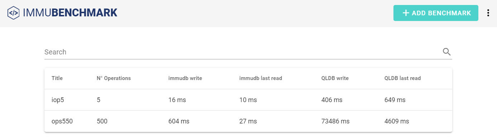

<!--
---
title: "immudb"
custom_edit_url: https://github.com/codenotary/immudb/edit/master/README.md
---
-->

# immudb  

immudb is **lightweight, high-speed immutable database** for systems and applications. With immmudb you can
track changes in sensitive data in your transactional databases and then record those changes indelibly in a the 
tamperproof immudb database. This allows you to keep an indelible history of, say, your debit/credit transactions. 

Traditional transaction logs are hard to scale, and are not immutable. So there is no way to know for sure if your data has been compromised. 

As such immudb provides **unparalleled insights** **retro-actively**, of what happened to your sensitive data, even
if your perimiter was compromised. immudb provides the guarantatee of immutability by using internally a **Merkle tree structure**. 

immudb gives you the same **cyrptographic verification** of the integrity of data written with **SHA-256** like classic blockhain without the cost and complexity associated with blockhains today. 

immudb has 4 main benefits:

1. **immudb is immutable**. You can only add records, but **never change or delete records**.
2. data stored in immudb is **cryptographically coherent and verifiable**, like blockchains, just without all the complexity and at high speed.
3. Anyone can get **started with immudb in minutes**. Wether in node.js, Java, Python, Golang, .Net, or any other language. It's very easy to use and you can have your immutable database running in just a few minutes. 
4. Finally, immudb is  **Open Source**. You can run it **on premise**, or in the **cloud** and it's completely free. immudb is governed by the Apache 2.0 License.

immudb is currently runs on **Linux**, **FreeBSD**, **Windows**, and **MacOS**, along with
other systems derived from them, such as **Kubernetes** and **Docker**.

## Contents

1.  [What does it look like?](#what-does-it-look-like) - Take a quick tour through the project
2.  [Our userbase](#user-base) - Our userbase
3.  [Quickstart](#quickstart) - How to try it now on your systems, get a Docket container running in seconds
4.  [Why immudb](#why-immudb) - Why people love immudb and how it compares with other solutions
5.  [News](#news) - The latest news about immudb
6.  [How immudb works](#how-immudb-works) - A high-level diagram of how immudb works
7.  [Features](#features) - How you'll use immudb on your systems
8.  [Read world examples](#examples) - Read about how others use immudb
9.  [Documentation](#documentation) - Read the documentation
10. [FAQ](#faq) - Frequently asked questions
11. [Community](#community) - Discuss immudb with others and get support
12. [License](#license) - Check immudb's licencing
13. [Is it awesome?](#is-it-awesome) - Yes.

## What does it look like?

### High level features

#### Simplified API for safe SET/GET
single API call that performs all steps and returns the proofs directly.

#### REST gateway (for legacy systems)
A gRPC REST gateway is a reverse proxy that sits in the middle between the gRPC API and the application.

Other than simply converting the gRPC API to a REST interface, this component will have a built-in verification on query results and will return the verification result directly. 

This solution is completely transparent: the client application can use just one endpoint (the REST interface) to perform all operations.
The REST gateway can be also embedded into the immud binary directly.

#### Driver for common languages
Driver available for:
1. Java
2. .net
3. Golang
4. Python
5. Node.js

#### Structured value
The Any message type of protobuffer allows to lets you use messages as embedded types without having their .proto definition. Thus it’s possible to decouple and extend (in future) the value structure.
Value can be augmented with some client provided metadata. That also permits to use an on-demand serialization/deserialization strategy

#### Item References
enables the insertion of a special entry which references to another item

#### Value timestamp
The server should not set the timestamp, to avoid relying on a not verifiable “single source of truth”. 
Thus the clients have to provide it. The client driver implementation can automatically do that for the user.

#### Primary Index
Index enables queries and search based on the data key

#### Secondary Index
Index enables queries and search based on the data value

#### Cryptographic signatures
A signature (PKI) provided by the client can be became part of the insertion process

#### Authentication (transport)
integrated mTLS offers the best approach for machine-to-machine authentication, also providing communications security (entryption) over the transport channel

### Benchmark

* 4 CPU cores
* Intel(R) Xeon(R) CPU E3-1275 v6 @ 3.80GHz
* 64 GB memory
* SSD

### Tech specs

| Topic                     | Description                                      |
|---------------------------|--------------------------------------------------|
| DB Model                  | Key-Value store with 3D access (key-value-index) |
| Data scheme               | schema-free                                      |
| Implementation design     | LSM tree with value log and parallel Merkle Tree |
| Implemementation language | Golang                                           |
| Server OS(s)              | BSD, Linux, OS X, Solaris, Windows               |
| Embeddable                | Yes, optionally                                  |
| Server APIs               | gRPC (using protocol buffers); immugw RESTful    |
| Partition methods         | Sharding                                         |
| Consistency concepts      | Eventual Consistency Immediate Consistency       |
| Transaction concepts      | ACID with Snapshot Isolation (SSI)               |
| Durability                | Yes                                              |
| Snapshots                 | Yes                                              |
| High Read throughput      | Yes                                              |
| High Write throughput     | Yes                                              |
| Optimized for SSD         | Yes                                              |

## User base

### Docker pulls

We provide Docker images for the most common architectures. These are statistics reported by Docker Hub:

## FAQ

| Question                                                                                     | Answer                                                                                                                                                                                                                                                                                                                                                                                                    | Release date    |
|----------------------------------------------------------------------------------------------|-----------------------------------------------------------------------------------------------------------------------------------------------------------------------------------------------------------------------------------------------------------------------------------------------------------------------------------------------------------------------------------------------------------|-----------------|
| Where is the Immudb data stored?                                                             | Files in the working directory                                                                                                                                                                                                                                                                                                                                                                            | initial release |
| How is the data structured?                                                                  | Data is stored in a Key-Value fashion. Data is always appended and never overwritten, so multiple versions of the same Key-Value can exist and can be inspected (by using the History API).                                                                                                                                                                                                               | initial release |
| What kind of data can be stored?                                                             | Any kind of Key-Value of data, values can be json data, configuration data, etc... Clients can choose how to structure data.                                                                                                                                                                                                                                                                              | initial release |
| What happens to my data if someone tamperes with it?                                         | immudb is a tamper-evident history system. When data (or the data history) is being tampered, the DB will not able to produce a valid consistency proof, so each client connect to the db will be able to notice the tampering and notify the user.                                                                                                                                                       | initial release |
| How can data be backed up?                                                                   | immudb provides APIs to perform online backups and restores. Data will be dumped to files.                                                                                                                                                                                                                                                                                                                | initial release |
| How can data be restored?                                                                    | Backups files can easily restored using the built-in client.                                                                                                                                                                                                                                                                                                                                              | initial release |
| Is there a way to incremently backup data?                                                   | immudb provides stream APIs and data can be streamed in insertion order, that can be easily used to perform incremental backups and incremental restores.                                                                                                                                                                                                                                                 | Q3/2020         |
| Is there a way to incremently restore data?                                                  | (see above)                                                                                                                                                                                                                                                                                                                                                                                               | Q3/2020         |
| How can the data be replicated to other systems?                                             | Our goal is to provide a scalable and redundant solution for enterprises. The investigation for the best approach is ongoing and not finalized yet. Our goal is to have it ready shortly after the official enterprise version release                                                                                                                                                                    | Q3/2020         |
| Would replication stop, when unverifiable data is detected?                                  | Customers will able to configure the wanted behavior when a unverifiable state is detected across replicas. By default, all valid replicas will able to continue working and replicas with invalid states will be skipped by all clients.                                                                                                                                                                 | Q3/2020         |
| Somebody changes one value in the database - how can it be detected and reverted?            | With replication, it's possible to detect which replica nodes are valid and which are not. If at least a replica node was not tampered data can be easily restored.                                                                                                                                                                                                                                       | Q3/2020         |
| Somebody changes the merkle root entry - how can I recover?                                  | Each client locally stores the last valid Merkle Tree Root (just 32 bytes of data). When the root of a DB instance is tampered then client will be able to mathematically proof that the provided root is not consistent with the last valid one. If an authenticated backup or a not tampered replica node is available, not-tampered data can be used to recover the Merkle Tree Root to a valid state. | Q3/2020         |
| How is the database protected? outside probes?                                               | Each client helps in protecting the DB. Special clients (called "agents") can be installed on different systems and continuosly monitor the DB.                                                                                                                                                                                                                                                           | Q3/2020         |
| How can I monitor database performance?                                                      | immudb provides realtime metrics that can be collected using Prometheus                                                                                                                                                                                                                                                                                                                                   | initial release |
| How can I monitor database health?                                                           | immudb provides realtime healthcheck endpoints via API and immu client                                                                                                                                                                                                                                                                                                                                    | initial release |
| How can I monitor database integrity?                                                        | immudb provides proof APIs and clients and agents can ask for proof in realtime.                                                                                                                                                                                                                                                                                                                          | initial release |
| How can I monitor database integrity for single objects or specific entries?                 | immu client has a functionality to authenticate a specific entry at a given point in time. So both last version and the whole history of an item can be verified.                                                                                                                                                                                                                                         | initial release |
| Can I build and distribute an immudb that skips the verification? If yes, how to avoid that? | CodeNotary team notarizes sources and releases of all immudb components. Only one authentic client notarization by the CodeNotary team required to detect fake installations or any kind of tampering.                                                                                                                                                                                                    | initial release |
| How many databases can I run on a single immudb server?                                      | We currently support one database, but in future releases there will be support for many databases.                                                                                                                                                                                                                                                                                                       | Q3/2020         |

## Community

We welcome [contributions](CONTRIBUTING.md). Feel free to join the team!

To report bugs or get help, use [GitHub's issues](https://github.com/codenotary/immudb/issues).

## License

immudb is [Apache v2.0 License](LICENSE).

immudb re-distributes other open-source tools and libraries. (++add repo list++)

## Is it awesome?

Yes.

