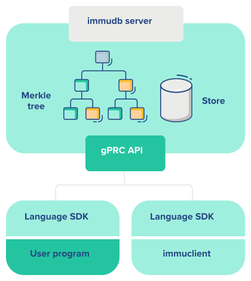

# Getting started with immudb development

### Getting started with immudb Development <a href="#getting-started-with-immudb-development" id="getting-started-with-immudb-development"></a>

This guide provides developers with the first steps for using immudb from your applications and with your favorite programming language:

* Connect to the database
* Insert and retrieve data


To learn how to develop for immudb with Python in a guided online environment, visit the immudb Playground at <https://play.codenotary.com>


## SDKs

In the most common scenario, you would perform read and write operations on the database talking directly to the server. In this case your application will act as an immudb client.

SDKs make it comfortable to talk to the server from your favorite language, without having to deal with communications details.

The most well-known and recommended immudb SDK is written in [Golang](https://golang.org/), but there are other SDKs available, both maintained by the internal team and by the community.


| Language         | Maintainer | Immdb version | link | Notes                                                                              |
|-------------------|---------|------------------|-------------|-----------------------------------------------------------|
| `go`               | immudb team  | 1.2.1       |     [link](https://pkg.go.dev/github.com/codenotary/immudb/pkg/client)  |                                   |
| `python`               | immudb team  | 1.2.1       |  [link](https://github.com/codenotary/immudb-py) | Verification is not working                                    |
| `JAVA`               | immudb team  | 1.2.1       |   [link](https://github.com/codenotary/immudb4j)  | Verification is not working                                      |
| `.NET`               | immudb team  | 1.2.1       |   [link](https://github.com/codenotary/immudb4dotnet)  | Verification is not working                                      |
| `NODE`               | immudb team | 1.2.1       |   [link](https://github.com/codenotary/immudb-node) | Verification is not working                 |
| `JS`               | immudb team | 1.2.1       |   [link](https://github.com/codenotary/immu-js) | Verification is not working                 |
| `ruby`               | Community ([Ankane](https://github.com/ankane))  | 1.2.1       |   [link](https://github.com/ankane/immudb-ruby) |Verification is not working                 |


For other unsupported programming languages, we provide, [immugw](https://github.com/codenotary/immugw) a proxy which provides a REST gateway that can be used to talk to the server via generic HTTP and which communicates with immudb's gRPC API.

The immudb server manages the requests from the outside world to the data store. In order to insert or retrieve data, you need to communicate with the immudb server.




## Connecting from your programming language

### Importing the SDK

In order to use the SDK, you need to download and import the libraries:

[//]: # "we need to decide whether we want to recreate the tabs here or go with a separate section for each"

:::: tabs

::: tab Go

```shell script
# Make sure your project is using Go Modules
go mod init example.com/hello
go get github.com/codenotary/immudb/pkg/client
```

```go
// Then import the package
import (
    immudb "github.com/codenotary/immudb/pkg/client"
)
 ```

:::

::: tab Java
Just include immudb4j as a dependency in your project:

if using `Maven`:

```xml
    <dependency>
        <groupId>io.codenotary</groupId>
        <artifactId>immudb4j</artifactId>
        <version>0.9.0.6</version>
    </dependency>
```

if using `Gradle`:

```groovy
    compile 'io.codenotary:immudb4j:0.9.0.6'
```

[Java SDK repository](https://github.com/codenotary/immudb4j)

immudb4j is currently hosted on both [Maven Central] and [Github Packages].

[Github Packages]: https://github.com/orgs/codenotary/packages?repo_name=immudb4j
[Maven Central]: https://search.maven.org/artifact/io.codenotary/immudb4j
:::

::: tab Python
Install the package using pip:

```shell
    pip3 install immudb-py
```

 Then import the client as follows:

```python
    from immudb import ImmudbClient
```

*Note*: immudb-py need `grpcio` module from google. On Alpine linux, you need
 these packages in order to correctly build (and install) grpcio:

* `linux-headers`
* `python3-dev`
* `g++`

[Python SDK repository](https://github.com/codenotary/immudb-py)

:::

::: tab Node.js

Install the package using npm:

```shell
    npm install immudb-node
```
Codenotary
Include the immudb-node as a dependency in your project.

```javascript
 const immudbClient = require('immudb-node')
```
Codenotary
[Node.js SDK repository](https://github.com/codenotary/immudb-node)

:::

::: tab .Net

Use Microsoft's [NuGet](https://www.nuget.org/packages/Immudb4DotNet/) package manager to get immudb4DotNet.

Creating a Client.

* Using the default configuration.

 ```csharp
   var client = new CodeNotary.ImmuDb.ImmuClient("localhost"))
 ```

* The immudb implements IDisposable, so you can wrap it with "using".

 ```csharp
 using (var client = new CodeNotary.ImmuDb.ImmuClient("localhost", 3322)){}
 ```

 [.Net SDK repository](https://github.com/codenotary/immudb4dotnet)
:::

::: tab Others
If you're using another language, then read up on our [immugw](/master/immugw/) option.
:::

::::

### Connection and authentication

The first step is to connect to the database, which listens by default in port 3322 and authenticate using the default user and password (`immudb / immudb`):

>Note: You can [change the default immudb server options](../reference/configuration.md) using environment variables, flags or the `immudb.toml` configuration file.

:::: tabs

::: tab Go

```go
import (
 "log"
 "context"
 immudb "github.com/codenotary/immudb/pkg/client"
)

opts := immudb.DefaultOptions().
            WithAddress("localhost").
            WithPort(3322)

client := immudb.NewClient().WithOptions(opts)
err := client.OpenSession(context.TODO(), []byte(`immudb`), []byte(`immudb`), "defaultdb")
if err != nil {
    log.Fatal(err)
}

defer client.CloseSession(context.TODO())

// do amazing stuff
```

:::

::: tab Java

```java
client = ImmuClient.newBuilder()
    .withServerUrl("localhost")
    .withServerPort(3322)
    .build();
client.login("immudb", "immudb");
```

:::

::: tab Python

```python
from immudb.client import ImmudbClient
ic=ImmudbClient()
ic.login("immudb","immudb")
```

:::

::: tab Node.js

```javascript
const ImmudbClient = require('immudb-node');

const cl = new ImmudbClient();

(async () => {
  try {
    const loginReq = { user: 'immudb', password: 'immudb' }
    const loginRes = await cl.login(loginReq)
// ...
} catch (err) {
    console.log(err)
  }
})()
```

You can also use exported types in your TypeScript projects:

```typescript
import ImmudbClient from 'immudb-node'
import Parameters from 'immudb-node/types/parameters'

const cl = new ImmudbClient();

(async () => {
  try {
    const loginReq: Parameters.Login = { user: 'immudb', password: 'immudb' }
    const loginRes = await cl.login(loginReq)
// ...
} catch (err) {
    console.log(err)
  }
})()
```

:::

::: tab .Net
This feature is not yet supported or not documented.
Do you want to make a feature request or help out? Open an issue on [.Net sdk github project](https://github.com/codenotary/immudb4dotnet/issues/new)
:::

::: tab Others
If you're using another development language, please refer to the [immugw](/master/immugw/) option.
:::

::::

### Tamperproof read and write

:::: tabs

You can write data to immudb with built-in cryptographic verification. Any client talking to immudb can independetnly run it's own client side verification of the resulting mathematical validations. This is transparent to the application and your application uses a traditional read or write function.

::: tab Go

```go
vtx, err := client.VerifiedSet(ctx, []byte(`hello`), []byte(`immutable world`))
if err != nil {
    log.Fatal(err)
}

fmt.Printf("Set and verified key '%s' with value '%s' at tx %d\n", []byte(`hello`), []byte(`immutable world`), vtx.Id)

ventry, err := client.VerifiedGet(ctx, []byte(`hello`))
if err != nil {
    log.Fatal(err)
}
 
fmt.Printf("Sucessfully verified key '%s' with value '%s' at tx %d\n", ventry.Key, ventry.Value, ventry.Tx)
```

:::

::: tab Java
This feature is not yet supported or not documented.
Do you want to make a feature request or help out? Open an issue on [Java sdk github project](https://github.com/codenotary/immudb4j/issues/new)
:::

::: tab Python
This feature is not yet supported or not documented.
Do you want to make a feature request or help out? Open an issue on [Python sdk github project](https://github.com/codenotary/immudb-py/issues/new)
:::

::: tab Node.js
This feature is not yet supported or not documented.
Do you want to make a feature request or help out? Open an issue on [Node.js sdk github project](https://github.com/codenotary/immudb-node/issues/new)
:::

::: tab .Net
This feature is not yet supported or not documented.
Do you want to make a feature request or help out? Open an issue on [.Net sdk github project](https://github.com/codenotary/immudb4dotnet/issues/new)
:::

::: tab Others
If you're using another development language, please refer to the [immugw](/master/immugw/) option.
:::

::::

## SQL Operations with the Go SDK

In order to execute SQL operations from the Go SDK, you'll need to create an immudb client and login to the server. First make sure you import:

```
"github.com/codenotary/immudb/pkg/api/schema"
"github.com/codenotary/immudb/pkg/client"
```

Then you can create the client and open a new session to the database:

```go
import (
"log"
"context"
immudb "github.com/codenotary/immudb/pkg/client"
)

c := immudb.NewClient()
err := c.OpenSession(context.TODO(), []byte(`immudb`), []byte(`immudb`), "defaultdb")
if err != nil {
    log.Fatal(err)
}

defer c.CloseSession(context.TODO())

// do amazing stuff
```

To execute SQL statements, use the `SQLExec` function, which takes a `SQLExecRequest` with a SQL operation:

```go
 _, err = c.SQLExec(ctx, `
  BEGIN TRANSACTION
          CREATE TABLE people(id INTEGER, name VARCHAR, salary INTEGER, PRIMARY KEY id);
          CREATE INDEX ON people(name)
  COMMIT
 `, map[string]interface{}{})
  if err != nil {
  log.Fatal(err)
 }
```

You can the insert data into the database:

```go
_, err = c.SQLExec(ctx, "UPSERT INTO people(id, name, salary) VALUES (@id, @name, @salary);", map[string]interface{}{"id": 1, "name": "Joe", "salary": 1000})
if err != nil {
    log.Fatal(err)
}
```

Once you have data in the database, you can use the `SQLQuery` method of the client to query it.

Both `SQLQuery` and `SQLExec` allow named parameters. Just encode them as `@param` and pass `map[string]{}interface` as values:

```go
res, err := c.SQLQuery(ctx, "SELECT t.id as d,t.name FROM (people AS t) WHERE id <= 3 AND name = @name", map[string]interface{}{"name": "Joe"}, true)
if err != nil {
    log.Fatal(err)
}
```

`res` is of the type `*schema.SQLQueryResult`. In order to iterate over the results, you iterate over `res.Rows`. On each iteration, the row `r` will have a member `Values`, which you can iterate to get each column.

```go
for _, r := range res.Rows {
    for _, v := range r.Values {
        log.Printf("%s\n", schema.RenderValue(v.Value))
    }
}
```

#### Additional resources <a href="#additional-resources" id="additional-resources"></a>

* Get the [immudb-client-example code (opens in a new window)](https://github.com/codenotary/immudb-client-examples)