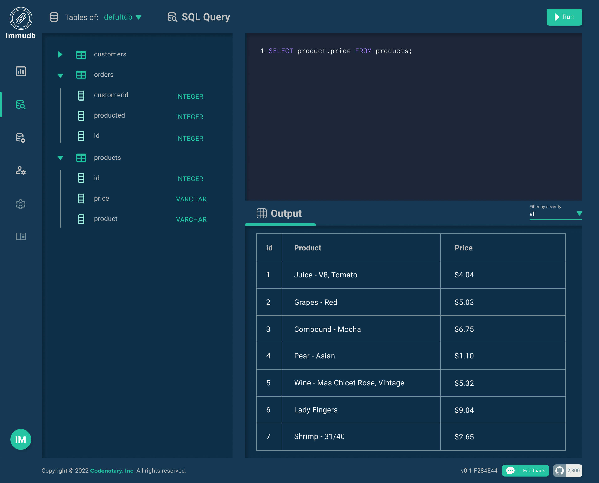
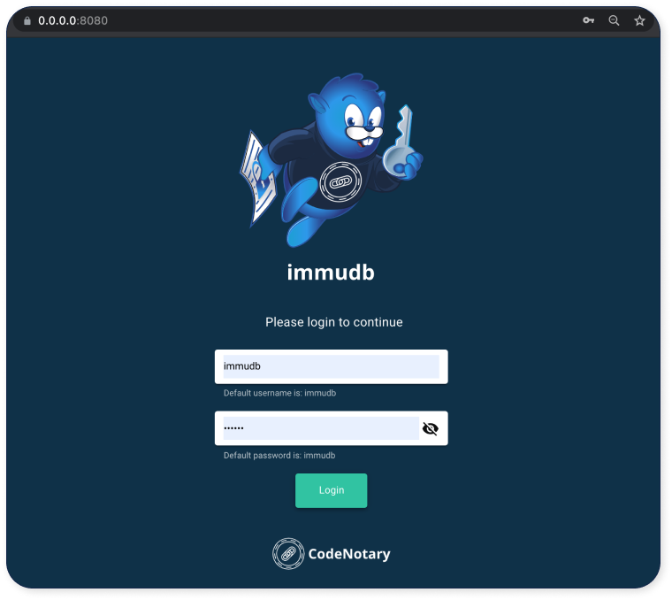

# The immudb web console

### The immudb Web Console <a href="#the-immudb-web-console" id="the-immudb-web-console"></a>

immudb includes an embedded web console which can be accessed via the default port 8080 (`web-server-port` option).



The console allows you to:

* Display metrics for the default database
* Execute SQL queries
* Configure users
* Create databases
* Manage permissions for users
* Other management functions

### Accessing the Web Console <a href="#accessing-the-web-console" id="accessing-the-web-console"></a>

Once immudb has started, it will tell you if the web console is enabled and where it is listening:

```
immudb  2021/05/17 21:38:30 INFO: Webconsole enabled: 0.0.0.0:8080
immudb  2021/05/17 21:38:30 INFO: Web API server enabled on 0.0.0.0:8080/api (http)
```

Just navigating to that address in your web browser will bring you to the login screen:

