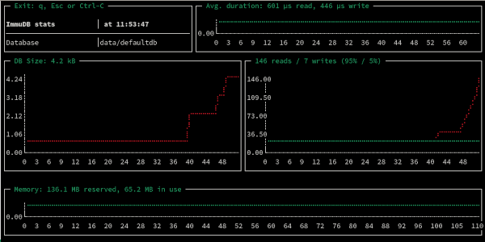
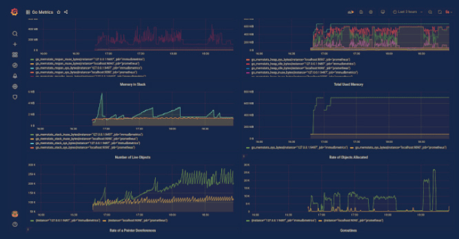

# Health monitoring

[//]: # "this needs to be greatly expanded to discuss the new metrics"

immudb exposes a Prometheus end-point, by default on port 9497 on `/metrics`.\
You can use `immuadmin stats` to see these metrics without additional tools:



immudb exports the standard Go metrics, so dashboards like [Go metrics (opens in new window)](https://grafana.com/grafana/dashboards/10826) work out of the box.



For very simple cases, to do a quick check if your immudb server is running, you can use `immuadmin status` from the monitoring scripts to ping the server:

```
$ immuadmin status
OK - server is reachable and responding to queries
```
