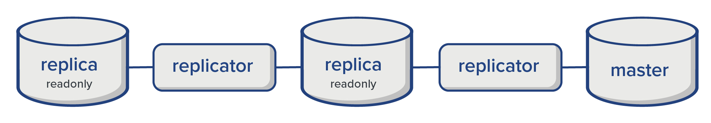

# Replication

### Replication strategy 

immudb includes support for replication by means of a follower approach. A database can be created or configured either to be a master or a replica of another database.

During replication, master databases have a passive role. The gRPC endpoint `ExportTx` is used by replicas to fetch unseen committed transactions from the master.

Replicas are read-only and any direct write operation will be rejected, however, queries are supported, providing the possibility to distribute query loads.

### Replication and users 

As shown in the diagram above, the replicator fetches committed transaction from the master via gRPC calls. Internally, the replicator instantiates an immudb client (using the official golang SDK) and fetches unseen committed transactions from the master. In order to do so, the replicator requires valid user credentials, otherwise the master will reject any request.

Note: currently only users with admin permissions are allowed to call `ExportTx` endpoint.

### Creating a replica 

Creating a replica of an existing database using `immuadmin` is super easy, replication flags should be provided when the database is created or updated as follow:

1. Login `./immuadmin login immudb`
2. Create a database as a replica of an existing database:

`./immuadmin database create --replication-enabled=true --replication-follower-username=immudb --replication-follower-password=immudb --replication-master-database=defaultdb replicadb`

Note: To display all database creation flags `./immuadmin database create --help`

### Creating a second immudb instance to replicate systemdb and defaultdb behaves similarly 

1. Start the immudb binary specifying the proper replication flags `./immudb --replication-enabled=true --replication-follower-password=immudb --replication-follower-username=immudb --replication-master-address=127.0.0.1`

Note: To display all replication flags `./immudb --help`

### Multiple replicas 

It's also possible to create multiple, indepedent replicas of a database.

The master database will act in passive mode. There are no special steps needed in order to create more replicas. You ca easily configure additional replicas by repeating the same steps used above to create the first replica.

### Replica of a replica 

In case many replicas are needed, for example, if the master database is under heavy load, it's possible to delegate the creation of replicas to an existing replica. This way, the master database is not affected by the total number of replicas being created.

### External replicator 

By creating a database as a replica but with disabled replication, no replicator is created for the database and an external process can be used to replicate committed transactions from the master. The gRPC endpoint `ReplicateTx` can be used to externally replicate a transaction.

### Heterogeneous settings 

Replication is configured per database. Thus, the same immudb server may hold several master and replica databases at the same time.

