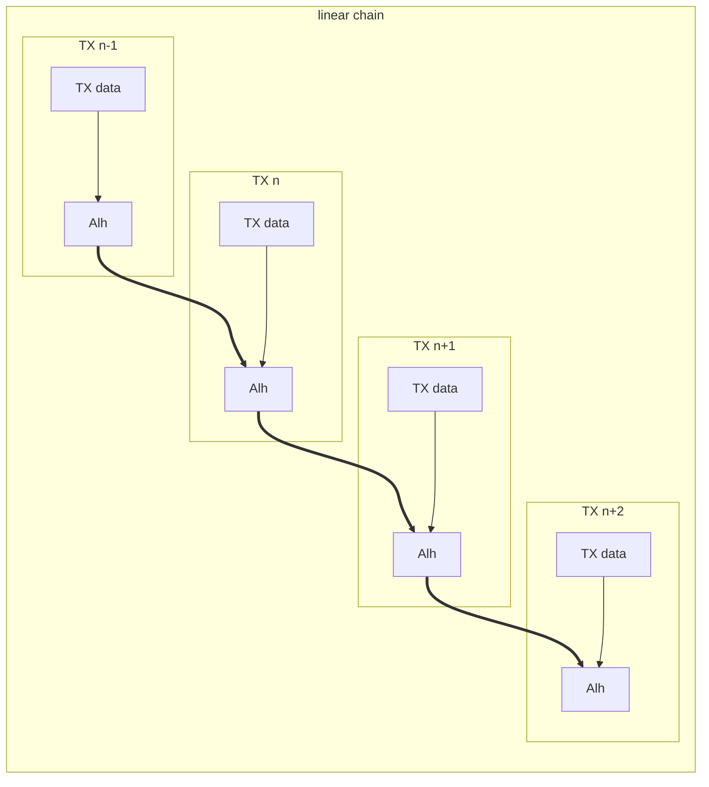
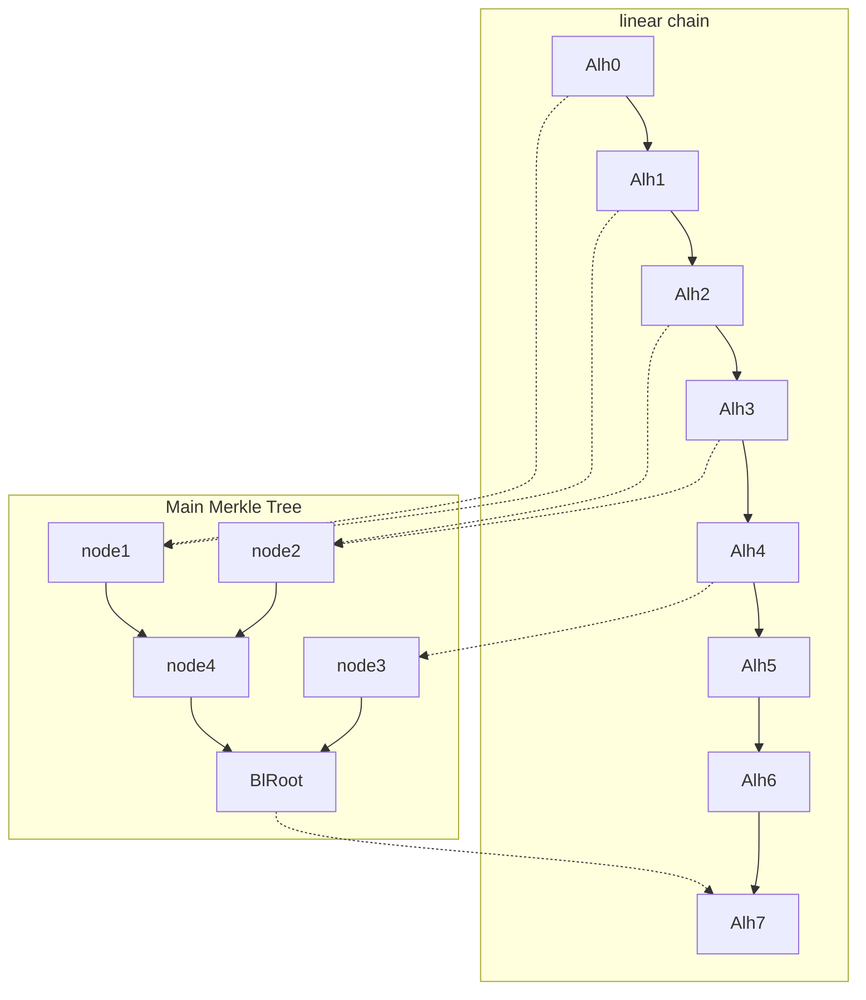
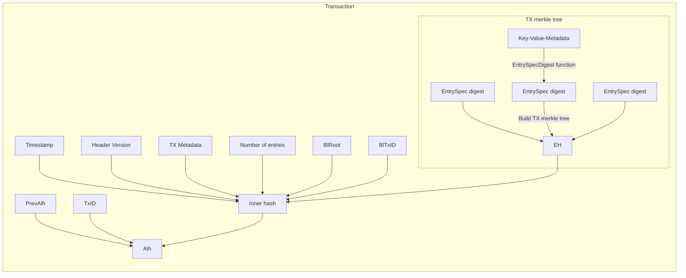
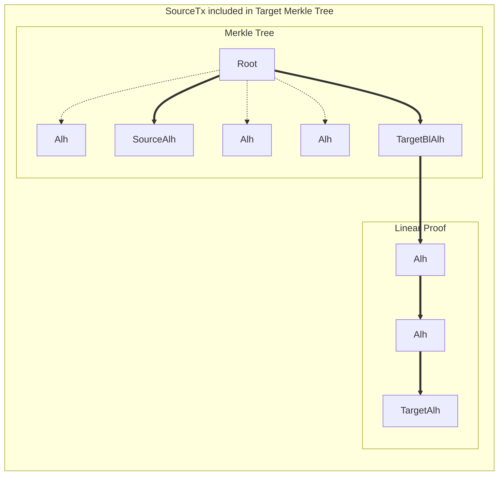
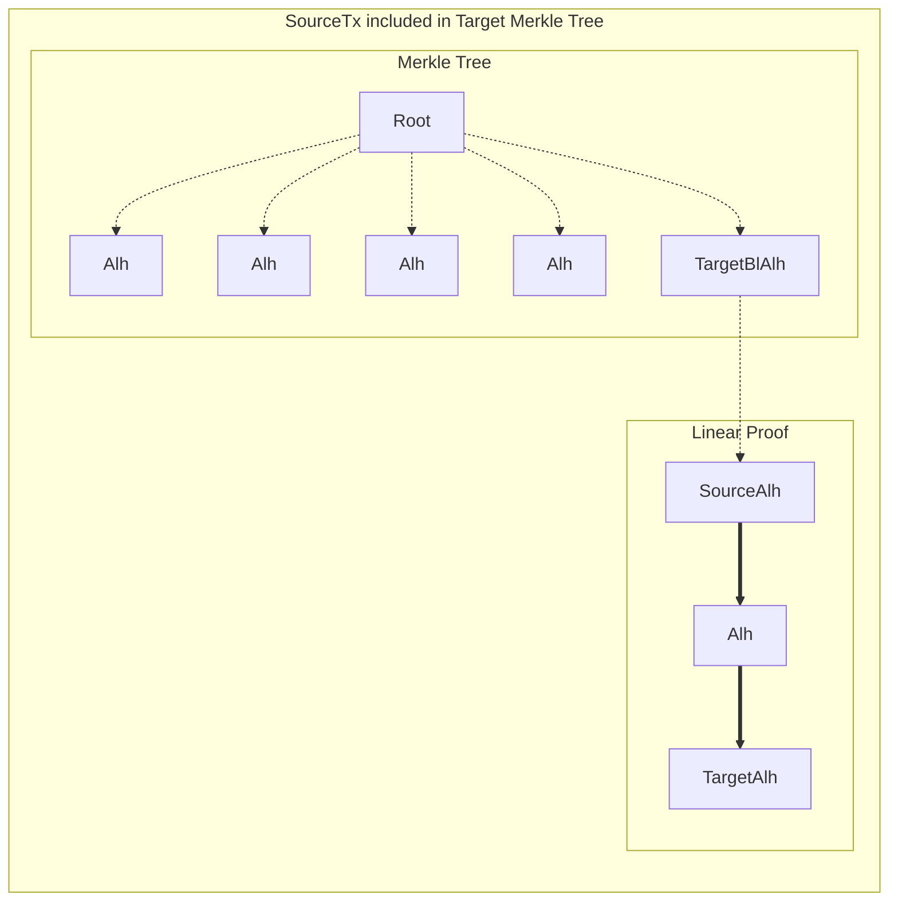

# Technical description of immudb proofs

This document describes immudb data structures and algorithms for
verification of data written to immudb.

## Data structures used in immudb

### Abbreviations

- **Alh** - Accumulated Linear Hash
- **Bl** - Binary Linking
- **EH** - Entries Hash

### Main Merkle Tree

Each database has one main [Merkle Tree][mtree] where its inputs
are built from transaction hashes (`Alh`). This tree is persisted in the
storage layer. It is also appendable - each new transaction adds one extra
leaf node with transaction hash (`Alh`) and rebuilds the path to the root.

### Internal Merkle Tree

Each transaction contains its internal [Merkle Tree][mtree] built from Key-Value-Metadata
entries that are part of that single transaction. The root hash of that Merkle Tree (`EH`)
along with transaction metadata and additional linear proof information is used to
build the transaction hash that is then input for the main [Merkle Tree][mtree].
This tree is not stored on disk and is recalculated on-demand from data that is building
up the transaction.

[mtree]: https://en.wikipedia.org/wiki/Merkle_tree.

### Linear proof

The additional linear proof for the transaction is a mechanism implemented in immudb
that is meant for handling peak transaction writes where the writes are much faster
than the main [Merkle Tree][mtree] recalculation. It also forms a linear chain
for all transactions since the beginning of the database.

Due to the linear chain, the Hash for each transaction is called **Accumulated Linear Hash**.

Subsequent `Alh` values from the transaction are inputs into the main Merkle Tree.

In a standard immudb installation, the length of the linear proof is limited to only 1 entry.

## State value stored on clients

In order to request consistency proofs, the client keeps information about the database
at a specific transaction. This information is the `Alh` value of the committed transaction.

Since the `Alh` is built from a chain of subsequent `Alh` values from previous transactions,
it is accumulating the whole history of the database.

In addition to the linear proof, each transaction also embeds the main Merkle
Tree hash (`BlRoot`) and its size (`BlTxID`) at the time when the transaction was committed.

The main Merkle Tree is then used to optimize generation of proofs.
The part of the proof that deals with the history of the database up to and including `BlTxID`
is done using the Merkle Tree (logarithmic complexity), the rest is done using the remaining
part of the linear proof that fills in the gap until the current transaction.

In the example above, the proof for inclusion of `Alh5`, `Alh6` or `Alh7`
can be conducted using only the linear proof only. For the inclusion of `Alh1`,
first the inclusion in the merkle tree is performed - that is the proof of inclusion
in the history up to the `BlTxID` transaction (equivalent of linear proof until
the `Alh4` node) followed by the linear proof until the `Alh7` node.

The length of the linear proof up to the point where the Merkle Tree can be used
should be kept at a sane level to avoid long linear proofs. Current version of immudb
does not allow a linear proof length to be greater than 1 by ensuring the main
Merkle Tree is updated as a part of the transaction commit phase.

## Advancing state of proofs for a single transaction

At the first step, each Key-Value-Metadata entry within a single transaction is hashed.
From the list of hashes, an internal Merkle tree is built. The root of this inner tree
is called `EH`. `EH` itself is a cumulative hash for all entries being part of
a single transaction without any additional information such as transaction ID or timestamp.
That also means that there can be multiple transaction having the same `EH` value
within a single immudb instance.

Additional `inner hash` is built by hashing the following fields of the transaction:
Transaction Timestamp, Header Version, Transaction metadata, number of entries,
`EH` and the main merkle tree state at the commit time: `BlTxID` and `BlRoot`.
This `inner hash` contains more information than a single `EH` value,
however it is still possible (but with pretty small probability in a common setup)
that there will be two transactions sharing the same `inner hash`
within the same immudb database.

The final hash built for a single transaction is `Alh`. That hash is built
by hashing the following: Transaction ID, `Alh` of a previous transaction and the `inner hash`.

The `Alh` hash is the input value (leaf) for the main Merkle Tree for a single database.
Whenever a new transaction is committed, its `Alh` value is then added to the main Merkle Tree.

Since the `Alh` of given transaction is built from hash of previous transaction, consecutive `Alh`
hashes form a chain where given `Alh` is signing the whole immudb state up till given transaction.
In addition to that, the inner hash is also built from the current main merkle tree state
(`BlTxID` - number of transactions already hashed in the main Merkle Tree, `BlRoot` - root hash
of the main Merkle Tree at the `BlTxID` transaction). From the `Alh` then we can perform a linear
proof until any point back in the history (which has linear complexity),
but once the `BlTxID` entry is reached, a more efficient proof can be generated using the main
Merkle Tree (which has logarithmic complexity).

## Verification of a single entry

The verification of a single entry is performed in two steps.
During the first step, the verification is performed on the transaction level to ensure that
the entry is a part of the transaction. Once the transaction is verified, additional proof
is conducted in the main merkle tree and linear proof level (thus its called Dual Proof)
that ensures that the transaction itself is valid.

### TX internal Merkle Tree verification

#### Step 1. Calculating entry digest

First the digest of Key-Value-Metadata entry is calculated. The calculation method depends
on the transaction context (TX Header Version) - which was necessary change in order to handle
entry metadata.

Note: If the returned value is a reference, we perform the proof for the reference entry,
not the value itself.

**Inputs:**
Key,
Value,
Metadata,
Tx Header Version

**Output:**
KVM Digest

**Failure when:**
The KVM has incorrect / insane values (e.g. metadata can not be interpreted correctly, key or value length is beyond limits)

**Code references:**

- <https://pkg.go.dev/github.com/codenotary/immudb/embedded/store#EntrySpecDigest_v0>
- <https://pkg.go.dev/github.com/codenotary/immudb/embedded/store#EntrySpecDigest_v1>
- <https://pkg.go.dev/github.com/codenotary/immudb/embedded/store#EntrySpecDigestFor>

#### Step 2. TX Inclusion proof

The Digest calculated in the previous step is then used to validate the inclusion proof
within the TX Merkle Tree. This proof consist of hashes within the TX Merkle Tree needed
to build the root hash of the tree (`EH`). The calculated `EH` value is then compared
with the value retrieved form the `DualProof` part given from the server.

**Inputs:**
KVM Digest,
Position within transaction (`proof.Leaf`),
Transaction size (`proof.Width`),
Inclusion Proof (`proof.Terms`)

**Output:**
the root of the Transaction Merkle Tree (`EH`)

**Failure when:**
The inclusion proof is invalid (not enough terms, zero tree width, leaf number beyond limits),
`EH` value does not match the `EH` value from `DualProof`

**Code references:**

- <https://pkg.go.dev/github.com/codenotary/immudb/embedded/store#VerifyInclusion>
- <https://pkg.go.dev/github.com/codenotary/immudb/embedded/htree#VerifyInclusion>

### DualProof - proof of inclusion of the transaction in database state

The dual proof serves two purposes - 1) it ensures that the validated Accumulative Linear Hash (`Alh`)
is correct and is a part of the database state (inclusion proof in the main merkle tree
along with the linear proof) and 2) that the history of the database transactions is consistent
with some older state that the client has seen in previous operations (merkle consistency proof and linear proofs).

Two transactions - the previously stored one and the one at which the value was retrieved - are ordered.
The earlier one is the SourceTX, the latter one is the TargetTX. The dual proof is meant to ensure that
SourceTx is consistent part of the history of TargetTX.

**Code references:**

- <https://pkg.go.dev/github.com/codenotary/immudb/embedded/store#VerifyDualProof>

#### Step 3. Validate Alh values for source and target transactions

For both the SourceTX and the TargetTX transactions, server sends transaction headers - those include
information that can be used to calculate the `Alh` values.

For both states (sourceAlh and targetAlh) this step proves that all the information building up
given transaction is correct. This is especially important in case of the link to `BlRoot` and
`BlTxId` used in that transaction to make sure that the part of the proof done on that tree
properly links to the linear proof ending up with `Alh`.

**Inputs:**
SourceTxHeader,
SourceAlh,
TargetTxHeader,
TargetAlh

**Outputs:**
none

**Failure when:**
Calculated `SourceAlh` and `TargetAlh` do not match expected values.

#### Step 4. Verify consistency of the SourceTXAlh in target Merkle Tree

If the SourceTx can be checked within the target Merkle Tree
(so that the target merkle tree was built up until at least the SourceTx transaction),
the SourceAlh is directly checked if it is a part of the Target Merkle tree.

If the SourceTx was not yet included in the target Merkle Tree,
the SourceAlh is validated against the linear proof from the TargetTx in steps that follow.

**Inputs:**
SourceTxID,
SourceAlh,
dualproof.InclusionProof,
TargetTxBlTxID,
TargetTxBlRoot

**Outputs:**
none

**Failure when:**
Can not prove inclusion of SourceAlh in the Target Merkle Tree

**Code references:**

- <https://pkg.go.dev/github.com/codenotary/immudb/embedded/ahtree#VerifyInclusion>

#### Step 5. Verify consistency between main merkle trees at SourceTX and TargetTX

Since TargetTX is after the SourceTX, this means that the main Merkle tree observed
in the TargetTX will be at least that one in the SourceTX. It can only contain new entries appended.
That property is validated with the consistency check.

**Inputs:**
SourceTxBlTxID,
SourceTxBlRoot,
TargetTxBlTxID,
TargetTxBlRoot,
dualproof.ConsistencyProof

**Outputs:**
none

**Failure when:**
Can not prove consistency of source Merkle Tree and target Merkle Tree

**Code references:**

- <https://pkg.go.dev/github.com/codenotary/immudb/embedded/ahtree#VerifyConsistency>

#### Step 6. Verify consistency of the last element of the target Merkle Tree

The `BlTxAlh` value is the `Alh` value of the transaction indexed at the `BlTxID` transaction.
This value must be the last leaf of that Merkle Tree. It is important to check this property
since we must be sure that there's continuity between the Merkle tree and the linear proof.
To do this, an inclusion proof is calculated for the last element of the merkle tree.

**Inputs:**
TargetTxBlTxID,
TargetTxBlTxAlh,
TargetTxBlRoot,
dualproof.LastInclusionProof

**Outputs:**
none

**Failure when:**
The last element of the Target Merkle Tree can not be proven

**Code references:**

- <https://pkg.go.dev/github.com/codenotary/immudb/embedded/ahtree#VerifyLastInclusion>

#### Step 7. Verify linear proof for the TargetAlh

If already included in the Target Merkle Tree, the `SourceAlh` is proven to be included
in the target Merkle Tree in step 4. In that case, it is necessary to check the linear proof that
extends beyond the target Merkle Tree. This linear proof starts at target `BlTxID` and ends at `TargetTxID`.

If the `SourceAlh` was not yet included in the Target Merkle Tree, the proof is done entirely
on the linear part - starting from the `SourceAlh` reaching the `TargetAlh`.

**Failure when:**
The linear proof part to get to the `TargetAlh` can not be proven.

**Code references:**

- <https://pkg.go.dev/github.com/codenotary/immudb/embedded/store#VerifyLinearProof>

#### Step 8. Verify inclusion of the consumed part of the linear proof

The consistency between two historical states must be proven both as a consistency
between Merkle Trees of those states but also as a consistency between linear parts
and Merkle Trees.

The Merkle Tree of the target transaction, when larger than the Merkle Tree of the source
transaction will contain entries that were previously part of the linear part in the source
transaction.

For that reason, it is necessary to ensure that all elements on this consumed linear part
are correctly added into the target Merkle Tree.

The proof consists of a series of inclusion proofs for elements in the consumed part of the
linear part, along with a linear proof for calculating those elements.

The range of elements to check is different depending on whether the `SourceTxID` is consumed
by the target Merkle Tree. If it is part of that target Merkle Tree, then the consumed part
is the whole linear chain in the old state (starting with `BlTxID` of the old state and ending
at the `SourceTxID`). If the `SourceTxID` is not yet a part of the target Merkle Tree then the
linear part to be checked is the one that spans between source `BlTxID` and target `BlTxID`.

It is important to note that the last element of the consumed linear proof part
is already validated through either inclusion of `SourceTxID` in target Merkle Tree (step 4)
or by the inclusion of last element of target Merkle Tree (step 6).

**Inputs:**
SourceTxID,
SourceTxBlTxID,
SourceAlh,
TargetTxBlRoot,
TargetTxBlTxID,
TargetTxBlAlh,
dualproof.LinearAdvanceProof

**Outputs:**
none

**Failure when:**
Can not prove inclusion of consumed linear proof in the target Merkle Tree.

**Code references:**

- <https://pkg.go.dev/github.com/codenotary/immudb/embedded/store#VerifyLinearAdvanceProof>

#### Step 9. Verify signature of the TargetTX

Once all the proofs are performed, the client validates the signature of the new state.
The signature os made over the following data sets serialized into a single byte array:

- database name length (32-bit BigEndian-encoded length of utf-8 encoded db name in bytes)
- database name (utf-encoded database without aty trailing zeros)
- transaction id (64-bit unsigned BigEndian-encoded integer)
- transaction alh (32-bytes)

This step is optional and only done if the client was set up with the corresponding server signing public key.

**Inputs:**
dbName,
TargetTxID,
TargetTxAlh,
Signature

**Outpus:**
none

**Failure when:**
The signature of the new state is invalid

**Code references:**

- <https://pkg.go.dev/github.com/codenotary/immudb/pkg/api/schema#ImmutableState.CheckSignature>

